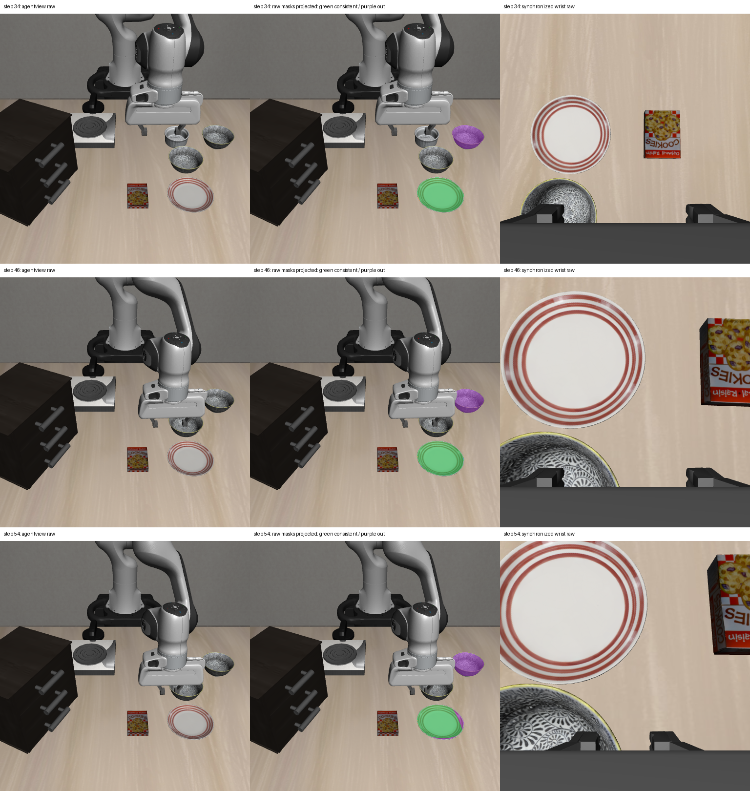

# 2026-10-04：48 步真实策略同步双相机运动段完成

## 完成情况

已将逐查询双相机 RGB-D 采集从 8 步扩展到 48 步真实 Pi0 动作，完整保存夹爪接近物体阶段的当前观测。中途 VPN 断线后，从仍在等待的第 22 步恢复同一 episode，最终完成实验，没有重新启动轨迹或跳过当前帧检测。

| 项目 | 实测结果 |
| --- | --- |
| 任务 | libero_spatial，零基 task 0，init 1，seed 11 |
| settle / policy / recovery 动作 | 10 / 48 / 0 |
| 查询步数 | 10–54，每隔 4 步，共 12 次 |
| 同步双相机查询保存与核验 | 12/12 组 |
| 同步双相机终态 | 第 58 步 |
| 固定相机视觉状态 | 5 次 ID 候选、4 次绑定拒绝、3 次场景拒绝 |
| benchmark done / visual success verified | false / false |
| 跨 Python 真实策略输出 | 12 个有限 50×7 动作数组 |
| worker 退出 | sequence 13 close ACK；主进程、worker 和实验 tmux 均退出 |

**已完成连续双视角数据采集与核验，尚未完成 RGB-D recovery。** 两相机采集不会自行解决语义、身份、抓取或执行问题；本轮没有恢复动作和任务成功率结论。

## 同步与运动核验

每个查询点的固定相机与腕部相机 episode、env_step、timestamp、标定版本和白名单本体状态一致。第 58 步终态也通过同一同步 gate。

11 个相邻查询间，两相机 RGB 和深度均更新，固定相机外参保持一致，腕部相机内参不变、外参随机器人运动更新。这里核对的是实际保存数组和标定，不只检查文件是否存在。

第 22 步断线时，服务器保持暂停等待 detector。VPN 恢复后日志显示仍为原 episode，relay 以 `--resume-step 22` 补齐当前 summary、检测和交接；最终 journal 连续包含全部 12 个查询步。断线改变墙钟等待时间，没有把等待时间当作新的仿真时间或额外动作。

沿用上轮部署的 27 个源码文件，启动前服务器哈希再次通过。Pi0 使用 CPU 推理，CPU affinity 为 0–7、数值库线程为 1；检查时八张 GPU 均有任务。仿真沿用图形渲染环境，不能将 CPU 策略推理解读为完全不使用图形设备。全部运行和数据目录在个人 `/mnt/sdb/24_yyx` 下。

## 逐查询跨视角诊断

对全部 12 组同步观测，用当前固定相机原始检测 mask 的有效深度反投影并投向同一步腕部相机。分别运行 2/5/10 mm 深度容差，共 36 组检查；保存源像素状态、目的像素坐标和 optical-Z 深度差，不运行新的腕部物体检测、不改原类别、不融合身份。

5 mm 容差下，后期三帧的固定相机 bowl/ramekin 跨类别重叠区域均没有投进腕部图像：

| 环境步 | 冲突重叠源像素 | 图像外 | 腕部相机后方 | 深度一致 |
| --- | ---: | ---: | ---: | ---: |
| 46 | 2254 | 2252 | 2 | 0 |
| 50 | 2336 | 2327 | 9 | 0 |
| 54 | 2344 | 2334 | 10 | 0 |

这些是固定相机当前原 mask 的冲突区域，不等同于最初目标或前碗的完整区域。图中冲突出现在右上碗状区域；腕部视角此时主要显示盘子及近处被截断的碗状区域。当前相机姿态无法为出图的冲突区域提供同帧深度验证，不能因第二相机存在就宣称类别消歧成功。

同三帧固定相机全部原 mask 并集的深度一致源点分别为 5220、4857、4879，主要可见对应在 plate 区域。这也不能证明 plate 的类别、支撑接触或放置完成。

第 34–54 步当前固定相机检测没有给出夹爪下方前碗的独立有效候选。因此，直接投影当前原 mask 还不能检查这个漏检目标的全部重叠区域。下一步应对当前腕部 RGB 独立检测、核验几何关联，并继续保留类别冲突和截断状态；不能把历史目标类别直接写回当前场景。

## 同步原图与投影状态

每行分别为第 34、46、54 步。左列固定相机原始 RGB，中列固定相机原 mask 投向腕部后的源像素状态，右列同一步腕部原始 RGB。绿色为深度一致，紫色为图像外/目的相机后方，橙色为目的表面更近，蓝色为目的表面更远。绿色不代表语义或身份已核验。



源点计数不等于唯一目的像素数；多个源点可落入同一目的像素。没有独立人工标签、mask IoU 或跨视角实例成功率。腕部图像中的边界截断和夹爪遮挡仍应保留为缺失证据。

## 验证与代码范围

- `audit_visual_query_camera_pairs.py` 实际核验 12 组查询、终态同步、trace、冻结 detector 关联、策略输出及 close ACK。
- `diagnose_query_cross_view.py` 完成全部 36 组投影，输入与源码哈希重新核对，各区域状态计数之和等于其源 mask 像素数。
- 采集分支沿用已通过的 21 项相关测试；本轮为断线续接补 SSH/SCP 有限重试，3 项针对性测试通过。持续网络故障仍抛出，不忽略远程命令错误或 detector 错误。
- 第 46/50/54 步已知场景拒绝产物保留并交接，服务器仍独立拒绝场景，VLA 继续。recovery 请求及 readiness 不因此升级为授权。
- 服务器 episode、本地采集审计和投影报告中的指定三个 oracle 模块导入尝试均为 0；该 guard 不覆盖任意仿真内存访问。

跨视角诊断只读取保存数据，没有额外 policy 推理、仿真启动或环境动作。所有诊断类别/身份/规划/执行标记保持 false，production_compatible=false。持物与目标完成仍未核验。

## 证据与路径

- [48 步真实 episode](rgbd_dual_48_live_episode_20261004.json)
- [12 条在线查询](rgbd_dual_48_live_trace_20261004.jsonl)
- [同步、运动、策略输出、续接记录与原始产物哈希](rgbd_dual_48_live_audit_20261004.json)
- [36 组逐查询投影报告](rgbd_dual_48_projection_report_20261004.json)
- [投影输入源码核验、状态计数核对及数组哈希](rgbd_dual_48_projection_audit_20261004.json)
- [复用的 27 个部署源码哈希](rgbd_dual_query_live_source_sha256_20261004.json)

本地完整数据：`D:\大三上\科研\visual-policy-dual-48-20261004`。

本地投影数组：`D:\大三上\科研\dual-48-query-cross-view-20261004`。

服务器数据：`/mnt/sdb/24_yyx/demo/visual-policy-dual-48-20261004`。

runtime：`/mnt/sdb/24_yyx/projects/visual-policy-dual-query-runtime-20261004`。

## 复现和下一步

沿用 [短程双相机实验](rgbd_dual_query_live_20261004.md) 的环境和命令，将 max_steps 改为 48，并使用新的输出目录；每个查询仍需冻结 detector 当前帧交接。完成后下载整个目录。

```powershell
& 'D:\大三上\科研\.venvs\vla-dev\Scripts\python.exe' `
  scripts/recovery/skill_pipeline/audit_visual_query_camera_pairs.py `
  --input-dir 'D:\大三上\科研\visual-policy-dual-48-20261004' `
  --out 'D:\大三上\科研\dual-48-audit-replay.json'

& 'D:\大三上\科研\.venvs\vla-dev\Scripts\python.exe' `
  scripts/recovery/skill_pipeline/diagnose_query_cross_view.py `
  --input-dir 'D:\大三上\科研\visual-policy-dual-48-20261004' `
  --out-dir 'D:\大三上\科研\dual-48-query-projection-new'
```

下一步优先对已保存的同帧腕部 RGB 独立运行冻结检测，再检查近处碗状区域的可见深度、边界截断和跨视角几何对应。出图、遮挡、语义冲突或身份不足继续返回 unknown，先验证可见感知，再考虑恢复执行。
