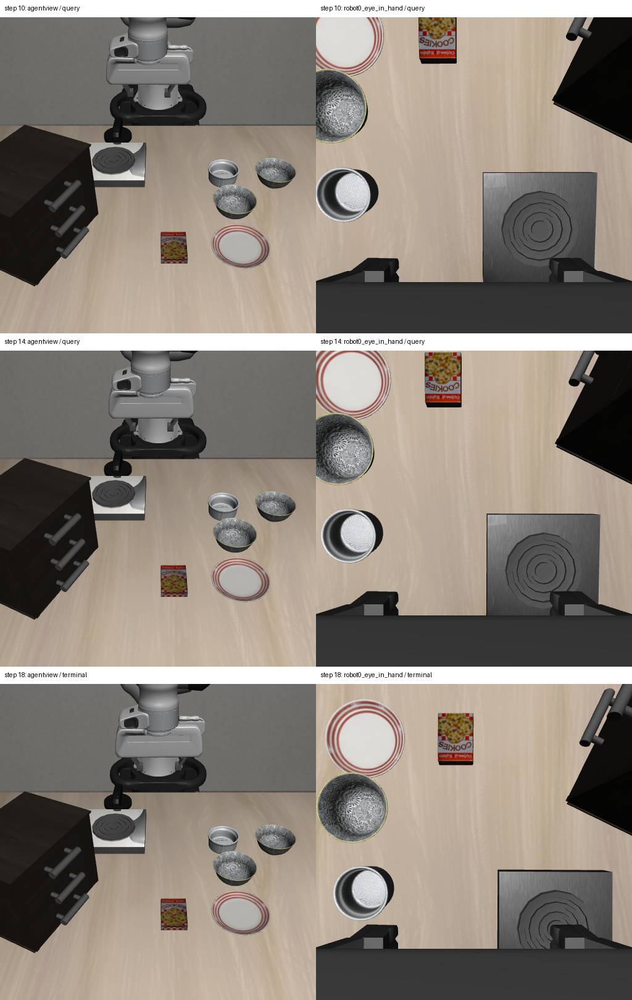

# 2026-10-04：逐查询双相机 RGB-D 真实采集验证

## 完成情况

逐查询同步腕部 RGB-D 保存代码已部署到个人服务器，并在 LIBERO 中通过真实 Pi0 checkpoint 完成短程实验。此前只有终态双相机数据的问题，已在新实验的两个查询点得到补齐。

| 项目 | 实测结果 |
| --- | --- |
| 任务 | libero_spatial，零基 task 0，init 1，seed 11 |
| settle / policy / recovery 动作 | 10 / 8 / 0 |
| 查询步数 | 10、14 |
| 查询同步双相机 RGB-D | 2/2 组保存并核验 |
| 终态同步双相机 | 第 18 步保存并核验 |
| 两次固定相机视觉状态 | visual_id_candidate |
| 首次强制 recovery 请求 | refused，继续 VLA |
| benchmark done / visual success verified | false / false |
| 部署源码 | 27 个文件，服务器哈希核验通过 |

本次用于验证采集改动，没有运行视觉 recovery executor，也没有 recovery 成功率结论。新轨迹仅 8 步，尚未覆盖旧 48 步轨迹后期的夹爪接近、遮挡和类别冲突场景。

## 采集真实性和同步核验

在每次固定相机查询完成后、下一次 policy 推理及动作前，从保持暂停的环境采集腕部 RGB-D。两相机 episode、env_step、时间戳、标定版本及白名单本体状态一致。两次查询的两相机有效深度像素均为 262144，图像为 512×512；有效深度覆盖不代表语义分割或几何已确认。

第 10→14 步之间执行 4 个真实策略动作，时间戳从约 0.50 到 0.70 秒：

- 两相机 RGB 和深度均更新。
- 本体末端位置变化约 **10.85 mm**。
- 腕部相机外参平移变化约 **9.94 mm**，旋转矩阵也变化；相机内参保持一致。
- 固定相机外参保持一致。

这些变化是两次查询之间的观测，不能解释为全部 8 步的末端位移，也不证明物体被抓取或随手移动。

两次跨 Python 真实策略推理分别返回有限的 50×7 动作数组，每次执行前 4 步。worker 的 sequence 3 close 请求收到 OK；实验 tmux、策略主进程和 worker 均已退出，没有留下本轮后台任务。

## 同步图像

左列为固定相机，右列为腕部相机；第 10、14 步为查询观测，第 18 步为终态。原始图像不叠加检测标签。



图像显示腕部视角随动作变化，部分对象可能接近图像边界。此次验证没有对腕部图像重新运行物体检测或跨视角身份融合；单纯保存双相机观测不能解决前轮的类别冲突。

## 部署与资源

检查时八张 GPU 均有任务，本次 Pi0 使用 CPU 推理，taskset 限制 CPU 核 0–7，并将数值库线程限制为 1。LIBERO 仍使用既有渲染环境，CPU 策略推理不等于完全不使用图形设备。全部部署、输出、日志均在 `/mnt/sdb/24_yyx` 个人目录，未修改全局环境。

源码包 SHA-256 为 `73c460013c85f23cf5a8a4e9778d00ac1a7664163def7015a8e21d013909f331`，本地与服务器一致。部署时逐文件核验 27 个源码哈希并用服务器 Python 3.8 完成编译检查；本地当前对应源码与部署清单一致。

沿用上轮已通过的 21 项相关测试，本轮完成实际环境集成核验，没有重复不变的单元测试。新增独立 `audit_visual_query_camera_pairs.py`，核对保存相机同步、查询 trace、冻结检测关联、动作数组、close ACK 和产物哈希；本次实际数据通过该脚本核验。

服务器 episode 和本地审计中的指定三个 oracle 模块导入尝试均为 0。该 guard 不覆盖任意仿真内存访问；RGB-D 标定与本体观测仍通过既有 sensor 采集。所有 readiness 的 execution_allowed=false，production_recovery_integrated=false；没有持物、接触或任务完成核验。

## 原始证据

- [真实 episode](rgbd_dual_query_live_episode_20261004.json)
- [两条查询 trace](rgbd_dual_query_live_trace_20261004.jsonl)
- [同步、运动、策略输出与全部产物哈希](rgbd_dual_query_live_audit_20261004.json)
- [27 个部署源码哈希](rgbd_dual_query_live_source_sha256_20261004.json)

路径：

- 本地完整数据：`D:\大三上\科研\visual-policy-dual-query-20261004`。
- 本地源码包：`D:\大三上\科研\visual_policy_dual_query_runtime_20261004.zip`。
- 服务器 runtime：`/mnt/sdb/24_yyx/projects/visual-policy-dual-query-runtime-20261004`。
- 服务器数据：`/mnt/sdb/24_yyx/demo/visual-policy-dual-query-20261004`。
- 服务器日志：`/mnt/sdb/24_yyx/visual-policy-dual-query-20261004.log`。

## 复现

使用独立且未存在的输出目录，在该 runtime 中运行：

```bash
taskset -c 0-7 env OMP_NUM_THREADS=1 OPENBLAS_NUM_THREADS=1 MKL_NUM_THREADS=1 \
  LIBERO_CONFIG_PATH=/mnt/sdb/24_yyx/config/libero \
  PYTHONPATH=/mnt/sdb/24_yyx/projects/LIBERO-f78abd68ee283de9f9be3c8f7e2a9ad60246e95c:/mnt/sdb/24_yyx/projects/visual-policy-dual-query-runtime-20261004 \
  /mnt/sdb/24_yyx/envs/libero-official/bin/python -u \
  -m experiments.robot.libero.skill_pipeline.runner \
  --visual_policy_eval --task_goal_source language_rgbd \
  --task_suite_name libero_spatial --task_ids 1 --episode_index_start 1 --seed 11 \
  --num_steps_wait 10 --action_chunk 4 --visual_policy_max_steps 8 \
  --pretrained_path /mnt/sdb/24_yyx/models/pi0_libero_openpi \
  --visual_policy_python /mnt/sdb/24_yyx/envs/openpi-jax/bin/python \
  --visual_prompts_json frozen_prompts.json --visual_resolution 512 \
  --visual_output_dir /mnt/sdb/24_yyx/demo/visual-policy-dual-query-new \
  --force_recovery_query 0
```

用既有 `relay_visual_policy_detector.py` 为当前固定相机帧进行本地 CPU 检测交接，READY 写入后服务器继续保存同步腕部观测。实验结束后取回完整目录，不能只取 relay 首次下载的固定相机 observation。

本地核验：

```powershell
& 'D:\大三上\科研\.venvs\vla-dev\Scripts\python.exe' `
  scripts/recovery/skill_pipeline/audit_visual_query_camera_pairs.py `
  --input-dir 'D:\大三上\科研\visual-policy-dual-query-20261004' `
  --out 'D:\大三上\科研\dual-query-audit-replay.json'
```

## 下一步

将同一采集机制扩展到覆盖夹爪接近物体的较长运动段，逐查询保留同步腕部深度和标定。再对同一步的机器人/物体重叠区域做跨视角投影与语义检查；无法区分的区域继续保持 unknown，恢复执行仍需独立抓取、持物、碰撞和完成证据。
