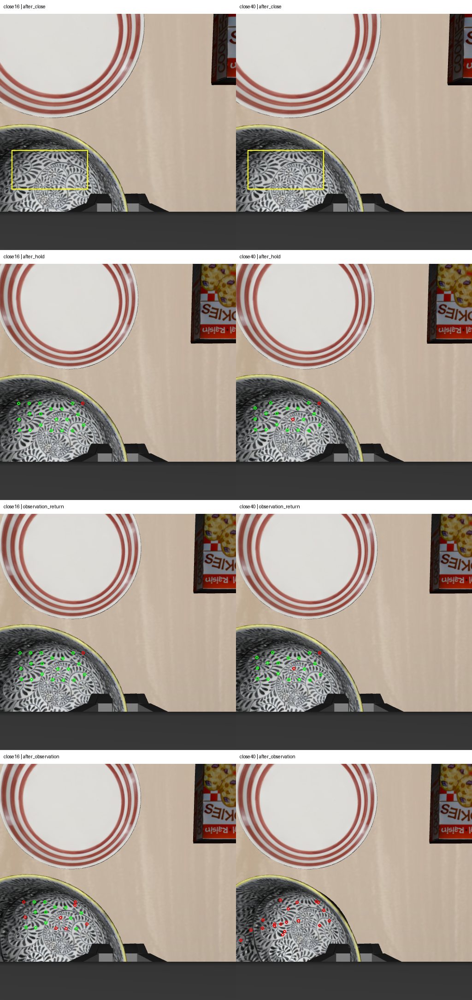

# 2026-10-07：闭爪等待时间对照

## 本轮结论

固定 10 mm 碗沿夹持深度，将闭爪等待由 16 步（0.8 秒）延长到 40 步（2 秒）。新实验实际执行 **354 步控制**，所有位置路点均到达 3 mm 阈值。

**延长闭爪等待没有得到稳定持物改善的证据。** 抬升和横移阶段仍有局部随动；返回时有 17/19 个纹理点通过检查，相对手部位移中位数为 3.87 mm。额外 2 秒停留后的纹理朝向、外观明显改变，最终 0/19 个源点通过固定匹配门槛，无法计算可信的终态物体位移。

这不是已经证实掉落，也不能把空统计当作零漂移。终态记录为 unknown，稳定持物、接触及任务成功均未验收，未执行放置。单次结果不能说明较长等待普遍更差。

## 对照条件和结果

基线使用 10 月 4 日的 10 mm、16 步闭爪观察实验。新实验的初始、预抓取、碗沿对齐及闭爪前双相机 RGB、深度、有效像素、内外参和本体状态与基线逐元素一致；前 230 个控制动作及末端反馈相同，包括共同的前 16 步闭爪。

目标、候选几何、控制增益、平移限幅、朝向、位置验收阈值、抬升路点、横移/返回及额外停留保持不变。唯一设置变化是闭爪阶段多等待 24 步。控制仍保持闭爪，不增加夹爪力参数。

| 指标 | 16 步基线 | 40 步对照 |
| --- | ---: | ---: |
| 闭爪阶段实际时间 | 0.8 秒 | 2 秒 |
| 实际控制动作 | 330 | 354 |
| 源帧碗面锚点 | 20 | 19 |
| 返回后通过检查 | 19/20 | 17/19 |
| 返回后相对手部位移中位数 | 3.47 mm | 3.87 mm |
| 最终通过检查 | 12/20 | 0/19 |
| 最终相对手部位移 | 6.81 mm | 无可靠统计 |

新实验在抬升后短暂停留的可见点升高中位数为 35.09 mm，末端升高 37.26 mm，支持早期抬升。最终点位相关系数最高仅 0.732，全部低于冻结的 0.90 门槛，没有放宽门槛补出成功结果。

闭爪后源图像随等待时间变化，锚点集合不同，点数不能直接当跨配置识别率或抓取成功率。盘子重复圆环纹理的负对照依旧薄弱；当前纹理检查不具备可靠处理大幅转动、外观变化的能力。

左为 16 步基线，右为 40 步对照；黄框为助手草拟源 ROI，绿点通过匹配，红点未通过。目标语义身份未自动核验，未人工复核，也不是盲测。

## 实现与核验

新增独立 `run_visual_grasp_close_wait_canary.py`，明确接受 16/40 两个步数，结果记录 `experimental_close_steps`。保留此前入口和结果。动作审计根据明确记录的步数核对闭爪计数，同时拒绝其他未声明的值。

354 行轨迹、16 组双相机同步、15 个部署源码文件、选择的当前观测与 mask 哈希、冻结纹理脚本和输入哈希核验通过。环境 reward 未用于决策，done 仅记录，不读取物体位姿或接触真值判定结果。指定模块 import guard 不等于全内存审计。

10 项针对性测试通过；更新后的动作审计另在原 16 步闭爪基线上复跑通过，保持历史实验计数核验。

服务器 tmux 已确认退出。policy 动作为 0，静置另有 10 步；正式 VLA/cuTAMP recovery 未参与。

## 下一步

深度增加和等待延长均未得到明确改善，暂停继续堆夹持参数。先检查终态碗面转动，补能处理旋转的跨帧对应或局部点云运动估计，并使用独立背景/机器人负对照验证。保留现有平移纹理检查作为固定基线，新增方法单独报告，不能把改变验收方法误当抓取能力提升。区分真实滑移、物体转动与跟踪失效后，再调整夹持方向或位置；验收前不接放置。

## 产物

- [对照条件与统计](rgbd_grasp_close_wait_comparison_20261007.json)
- [354 步实际结果](rgbd_grasp_close40_result_20261007.json)、[动作轨迹](rgbd_grasp_close40_trace_20261007.jsonl)
- [逐点纹理检查](rgbd_grasp_close40_texture_motion_20261007.json)
- [来源与动作审计](rgbd_grasp_close40_audit_20261007.json)、[部署源码清单](rgbd_grasp_close_wait_source_sha256_20261007.json)
- [16 步基线](rgbd_grasp_observation_20261004.md)

完整数据 `D:\大三上\科研\visual-grasp-close40-live-20261007`，纹理结果 `D:\大三上\科研\visual-grasp-close40-texture-motion-20261007`。服务器原始数据 `/mnt/sdb/24_yyx/demo/visual-grasp-close40-live-20261007`，运行时 `/mnt/sdb/24_yyx/projects/visual-grasp-close-wait-runtime-20261007`。

部署包 SHA-256：`832e491495fd7263e00f9ae91bbd78f0d21bea071be11e8af7c563b83ace73d7`。
