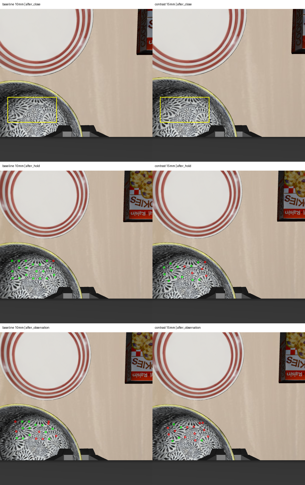

# 2026-10-04：碗沿夹持深度单变量对照

## 结果与决定

完成碗沿下方 **10 mm 基线与 15 mm 对照**，每个配置各一个相同 task/init/seed 的 episode。15 mm 新实验实际执行 **332 步控制**，所有位置路点到达 3 mm 阈值。

**没有得到增加夹持深度改善稳定性的证据，继续保留 10 mm 作为基线。** 两轮均有局部抬升、横移随动，但额外观察阶段仍存在碗面点相对手部的漂移。稳定持物及任务成功均未验收，未执行放置。

| 指标 | 10 mm 基线 | 15 mm 对照 |
| --- | ---: | ---: |
| 实际控制动作 | 330 | 332 |
| 闭爪前实际末端 Z 差异 | 参照 | 低 5.043 mm |
| 源帧碗面锚点 | 20 | 17 |
| 最终通过纹理检查 | 12/20 | 5/17 |
| 最终相对手部位移中位数 | 6.81 mm | 7.61 mm |
| 横移前与最终共同通过的锚点 | 12 | 5 |
| 共同锚点在该区间的高度变化中位数 | -3.930 mm | -4.299 mm |
| 同区间末端高度变化 | -0.119 mm | -0.119 mm |

不能据此断言深夹持普遍更差：闭爪后的视角和纹理不同，源锚点集合也不同，对照最终仅 5 个点，样本不足。相对漂移可能来自滑移、转动、遮挡或跟踪误差，当前未分离这些因素。

## 如何保证是深度对照

基于冻结的可见碗沿候选，只把 pinch goal 的 Z 减少 0.005 m；XY、可见 anchor、对齐路点保持相同。新入口接受 10/15 mm 两个明确参数值，检查目标 Z 仍处于已声明的仿真范围。

初始、预抓取和碗沿对齐三阶段的双相机 RGB、深度、有效像素、内外参及本体状态与基线逐元素一致。完成该检查后才复用冻结 mask，保存新 episode、步号、RGB/mask 哈希与缓存来源。目标依然由助手显式选择，未人工复核、未自动核验语义身份。

控制增益、平移限幅、朝向、3 mm 误差阈值、16 步闭爪、5/20/40 mm 抬升目标、10 mm 横移目标、返回和 40 步额外停留保持不变。不同配置反馈控制所需步数不同，不强行匹配步数。

纹理检查脚本与 ROI、阈值全部冻结。没有为了提高对照通过率重新挑区域、降低匹配门槛或延长搜索范围。盘子重复圆环纹理的负对照仍不可靠，不能作为强判据。

左列 10 mm，右列 15 mm；黄框为助手草拟源 ROI，绿点通过匹配检查，红点未通过。不同列的点不保证是相同物理表面点。

## 核验和边界

332 行动作轨迹、16 组同步双相机观测、15 个部署源码文件及冻结纹理脚本/输入哈希核验通过。目标 Z 差异重算为 -5 mm，实际闭爪前末端 Z 差异为 -5.043 mm。仿真 tmux 已退出。policy 动作为 0，静置另有 10 步；cuTAMP 和正式 recovery 仍未参与。

不使用物体位姿或接触真值判定结果。指定三个 oracle 模块的导入 guard 不等于完整内存访问审计。当前几何范围检查不等于完整碰撞检查。

## 下一步

不继续增加夹持深度。下一项对照保持 10 mm 深度，仅延长闭爪等待时间，检查闭爪后的初始运动及后续漂移是否改变；沿用当前基线和冻结的视觉检查，并保留失败结果。若仍无改善，需检查夹持方向与局部姿态，而不是继续堆参数。持物验收前不接放置。

## 可复核产物

- [对照统计与实验条件](rgbd_grasp_depth_comparison_20261004.json)
- [15 mm 实际结果](rgbd_grasp_depth15_result_20261004.json)、[332 步轨迹](rgbd_grasp_depth15_trace_20261004.jsonl)
- [逐点纹理和三维数据](rgbd_grasp_depth15_texture_motion_20261004.json)
- [观测与源码审计](rgbd_grasp_depth15_audit_20261004.json)、[部署源码清单](rgbd_grasp_depth_source_sha256_20261004.json)
- [10 mm 基线实验](rgbd_grasp_observation_20261004.md)

完整数据 `D:\大三上\科研\visual-grasp-depth15-live-20261004`，纹理结果 `D:\大三上\科研\visual-grasp-depth15-texture-motion-20261004`。服务器原始数据 `/mnt/sdb/24_yyx/demo/visual-grasp-depth15-live-20261004`，运行时 `/mnt/sdb/24_yyx/projects/visual-grasp-depth-runtime-20261004`。

部署包 SHA-256：`66e28050e8550185c20705860c5a2bb056ddebf27d8bdd96b41ac5ad3aafcd87`。
