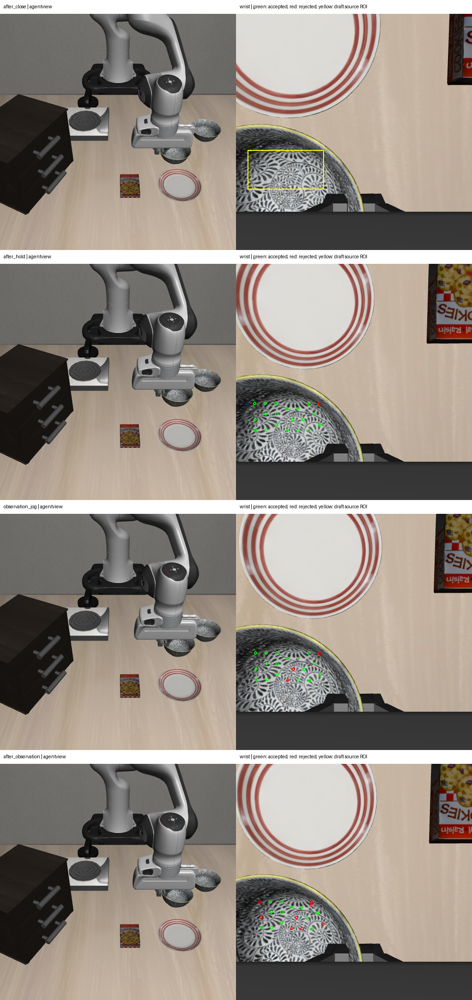

# 2026-10-04：碗面三维随动证据与抓取后观察实验

## 结论

本轮从仅有末端位置到达，推进到**有 RGB-D 证据支持目标候选被抬起并随机械臂横移**。助手圈出的前侧碗面纹理，在抬升后的三维高度中位数增加 35.2 mm，同期末端增加 37.3 mm；随后新仿真的小幅横移也观察到局部随动。

额外 2 秒停留后，12 个共同纹理点相比横移前的高度中位数降低 3.93 mm，而末端高度仅降低 0.12 mm。相对手部位移中位数从 2.25 mm 增至 6.81 mm；通过匹配检查的点从 19/20 降至 12/20。因此记录为 **视觉抬升证据支持、稳定持物未核验、可能滑移或转动**，不报告完整抓取成功。仍需分开排查滑移、转动、遮挡及跟踪误差。

ROI 为助手根据原图显式选择，未人工复核，不是盲测；目标语义身份未核验。物理接触、长期稳定夹持和放置成功均未证明。生产 runner、VLA 触发及 cuTAMP 仍未接入。

## 检查方法

- 使用已保存双相机 RGB-D 和白名单本体观测，无物体位姿或接触真值。腕部相机运动通过每帧外参换算到世界坐标，避免把相机运动当成物体运动。
- 以闭爪后腕部图像为源帧，显式选择前侧碗面 ROI `[25,295,190,380]`，按纹理方差和至少 24 px 的间距选取最多 20 个局部锚点。未在后续帧重新挑选有利点位。
- 固定使用 17×17 灰度纹理块、±28 px 搜索、相关系数 ≥0.90、相距超过 4 px 的候选峰差 ≥0.015，以及往返匹配误差 ≤2 px。目标点须有有效深度，且不属于静态夹爪模型投影中深度相差 ≤5 mm 的像素。
- 对通过的匹配点反投影，计算世界坐标位移与手部坐标下的相对位移。匹配质量门槛只检验对应假设，不自动判为 holding。
- 盘子 ROI 作为腕部负对照，但重复圆环纹理导致多数帧没有唯一对应，仅最后两帧各通过 1/17 个点，不能当可靠的多点负对照。此前固定相机独立检测的 plate 可见 Z95 在五帧中的跨度为 0.066 mm；那是第一轮原始抓取的诊断结果，不是本次横移后重新检测的结果。

## 实际新增实验

服务器个人目录中重新执行同一 task/init/seed 的抓取，再增加：目标横移 10 mm、返回横移前位置、闭爪停留 40 步（2 秒）。横移、返回的位置验收均小于 3 mm。

实际横移 Y 为 7.33 mm，返回后相对横移前位置仍有约 2.50 mm 的 Y 残差，符合当前容差但并非精确回到起点。纹理运动必须与实际本体轨迹比较，不能拿名义 10 mm 当实际位移。

新 episode 为 `visual_grasp_observation_ff49919f49804f29af3dd01c8fbe27f8`。共执行 **330 步控制 + 10 步静置**，其中前 270 步与原抓取相同，新增 11 步横移、9 步返回、40 步停留。policy 动作为 0。当前初始及预抓取双相机 RGB、深度、有效像素、标定、本体状态均与上一轮完全一致后才复用冻结视觉候选；选择记录保存新 episode 和缓存来源。

| 相对闭爪后源帧 | 通过纹理检查 | 碗面点升高中位数 | 相对手部位移中位数 |
| --- | ---: | ---: | ---: |
| 5 mm 名义抬升路点 | 19/20 | 2.10 mm | 0.49 mm |
| 20 mm 名义抬升路点 | 18/20 | 16.40 mm | 1.01 mm |
| 40 mm 名义抬升路点 | 19/20 | 35.37 mm | 1.77 mm |
| 横移前短暂停留 | 19/20 | 35.16 mm | 2.25 mm |
| 横移后 | 17/20 | 34.22 mm | 2.94 mm |
| 返回后 | 19/20 | 33.89 mm | 3.47 mm |
| 额外 2 秒停留后 | 12/20 | 31.08 mm | 6.81 mm |

每行通过点集合可能不同。3.93 mm 的后续高度下降另用两帧都通过的同一组 12 个源锚点计算，避免只比较不同点集合的中位数。匹配点不等于独立试验，也不等于完整物体表面真值。

左列固定相机原图；右列腕部画面。源帧黄框为助手草拟 ROI，后续绿点表示通过固定匹配门槛，红点表示未通过，红点并不等于证实物体滑落。

## 实现与核验

新增 `probe_grasp_texture_motion.py`，接受磁盘观测和静态机器人模型，不创建仿真或执行环境动作；源码及输入哈希保存在报告中。新增观察实验入口 `run_visual_grasp_observation_canary.py`，保留旧 270 步入口与数据。本轮补充了相关匹配对真实平移/亮度变化、重复纹理歧义、无纹理画面的 3 项测试，与抓取/预抓取合计 **10 项测试通过**。

330 行动作轨迹、16 组双相机同步、当前选择的 RGB/mask 哈希、14 个部署源码文件及纹理输入哈希均核验通过。指定三个 oracle 模块的 import guard 不是全内存访问审计；离线纹理脚本没有仿真环境，不能据此宣称覆盖所有真值入口。服务器实验 tmux 已退出。

## 下一步

当前已有定量抬升及横移证据，后续应直接围绕夹持稳定性做一次固定条件对照：检查碗沿夹持深度、闭合时间以及停留时的局部运动，保留当前配置作为基线。用同一套已冻结的纹理检查记录是否仍有相对手部下移；视觉对应失效时保持 unknown。还需补可靠的背景/机器人负对照与自动目标绑定，才能将其升级成在线持物判据。稳定性通过后再接放置，当前不让未验收的持物状态进入放置动作。

## 产物

- [330 步实际结果](rgbd_grasp_observation_result_20261004.json)、[逐步轨迹](rgbd_grasp_observation_trace_20261004.jsonl)
- [各点匹配与三维数据](rgbd_grasp_observation_texture_motion_20261004.json)
- [共同锚点统计与结果解释](rgbd_grasp_observation_evidence_20261004.json)
- [动作、同步及来源审计](rgbd_grasp_observation_audit_20261004.json)、[部署源码清单](rgbd_grasp_observation_source_sha256_20261004.json)

完整新数据在 `D:\大三上\科研\visual-grasp-observation-live-20261004`，纹理结果在 `D:\大三上\科研\visual-grasp-observation-texture-motion-20261004`。服务器原始数据 `/mnt/sdb/24_yyx/demo/visual-grasp-observation-live-20261004`，运行时 `/mnt/sdb/24_yyx/projects/visual-grasp-observation-runtime-20261004`。

部署包 SHA-256：`ab5b9bb41a733c065d3c1873a73d1cb708eee5b7bffe0086ecb0fcd9a6ffdc00`。
