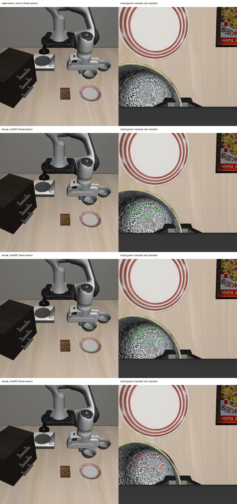

# 2026-10-07：连续 RGB-D 运动估计与密集观测重放

## 新结论

此前终态匹配失效，不能仅归因于算法，也不能直接判断掉落。本轮重放相同 40 步闭爪实验，并在额外停留段每两步（0.1 秒）保存双相机观测，得到局部碗面在手部附近逐渐转动的证据。

停留后的 **1.9 秒**仍有 **16 个持续纹理对应**，三维刚性拟合显示相对手部转动 **4.48°**；这些对应的世界坐标点群中心相对停留开始下降 **5.12 mm**。拟合残差中位数为 0.46 mm，分组校验最大残差为 1.48 mm。局部可见表面并非保持固定姿态。

最后 0.1 秒所有持续对应失效，终态依然 unknown。没有证明最终掉落、物理接触、语义身份或稳定持物。转动和点群中心下移可以同时发生；不能用局部刚体模型直接拆出夹持接触处的滑移量。

## 两种检查分开保留

先对已有稀疏观测新增旋转纹理块搜索：与扩大到 ±48 px 的纯平移搜索比较，额外加入 -40° 至 40° 的旋转角度。两种方法均在返回阶段找到 17 个对应，拟合相对手部约 3.26° 转动；最终都没有对应通过。只扩大搜索范围、加入图像平面旋转不足以恢复终态。

随后新增密集重放，使用短间隔连续对应，未替换此前冻结检查。以原返回阶段通过的 17 个点作为起始候选，只在相邻图像 ±8 px 范围内搜索，保持相关系数 ≥0.90、候选峰差 ≥0.015、反向相关系数 ≥0.90、往返像素误差 ≤2 px。要求有效深度，并排除静态夹爪模型深度一致像素；失效的点不重新加入。

从对应点的 RGB-D 反投影得到三维坐标，分别拟合世界坐标与手部坐标下的局部刚性运动。用三点假设寻找至少 6 点、至少 60% 的一致对应，3 mm 残差门槛；交替点组拟合和检查后再重拟合。校验点参与过一致集筛选，不是独立盲测样本。纹理和模型残差不能单独保证物理实例身份。

## 连续变化

下表的时间和转动均相对返回结束，即额外停留开始。

| 停留时间 | 持续对应点 | 相对手部转动 |
| --- | ---: | ---: |
| 0.5 秒 | 17 | 0.20° |
| 1.0 秒 | 17 | 0.75° |
| 1.5 秒 | 17 | 2.15° |
| 1.7 秒 | 16 | 3.31° |
| 1.9 秒 | 16 | 4.48° |
| 2.0 秒 | 0 | 无可靠统计 |

持续对应仍可能积累漂移；当前没有经过独立背景/机器人负对照评测，也不能把 16 个点当作 16 次抓取试验。这里给出局部运动假设的定量证据，不输出 holding=true。

左为固定相机原图，右为腕部及跟踪点。绿点表示持续跟踪，红点表示失效。最后一行不含可信三维终态估计。

## 实验与代码

新增 `visual_rigid_motion.py`：已知对应下的稳健三维刚性拟合，拒绝稀疏、共线或不一致数据。新增旋转搜索和密集对应诊断脚本，以及独立密集观测仿真入口。

新 episode `visual_grasp_dense_hold_17b10a20484e4bd3a2dc62407a066ed9` 执行 **354 步控制 + 10 步静置**，保存 **36 组同步双相机观测**。新旧 40 步闭爪实验的完整控制轨迹 JSONL 逐字节一致，实际动作及本体反馈相同；变化只有额外保存观测。选定当前初始/预抓取视觉候选前核对双相机数据一致，保存新 episode 和缓存来源。

**14 项针对性测试通过**，新增测试覆盖已知旋转/平移及错误对应、共线/非有限输入、静止点无运动、稀疏对应拒绝。16 个部署源码文件、观测同步、动作和诊断来源哈希核验通过；服务器 tmux 已退出。

目标为助手草拟候选，未人工复核。静态夹爪投影不包括完整机械臂；模块 import guard 不是全内存审计。未用场景物体真值判定运动或持物，policy 和 cuTAMP 未参与，正式 recovery 未接入。

## 下一步

先针对 1.9→2.0 秒的失效区间做逐控制步记录，检查是否发生突然转动、遮挡或图像对应跳变。已有可靠区间支持局部转动，后续抓取改动应关注夹持位置/方向和对碗的转动力矩，而不是继续延长闭爪等待。应补机器人及背景负对照，并在新的初始状态上验证局部运动方法；终态不可见时保持 unknown，持物验收前不执行放置。

## 产物

- [密集局部运动与逐点对应](rgbd_grasp_dense_motion_20261007.json)
- [扩大平移搜索与旋转搜索诊断](rgbd_grasp_rotation_bank_20261007.json)
- [新重放实际结果](rgbd_grasp_dense_result_20261007.json)、[354 步控制轨迹](rgbd_grasp_dense_trace_20261007.jsonl)
- [来源与轨迹审计](rgbd_grasp_dense_audit_20261007.json)、[部署源码清单](rgbd_grasp_dense_source_sha256_20261007.json)

完整数据 `D:\大三上\科研\visual-grasp-dense-live-20261007`，局部运动结果 `D:\大三上\科研\visual-grasp-dense-motion-20261007`，旋转搜索结果 `D:\大三上\科研\visual-grasp-close40-rotation-motion-20261007`。服务器数据 `/mnt/sdb/24_yyx/demo/visual-grasp-dense-live-20261007`，运行时 `/mnt/sdb/24_yyx/projects/visual-grasp-dense-runtime-20261007`。

源码包 SHA-256：`49c18ed4f3ca1c1c3b83ef53b92356c379ed9efab47c474c0f67825362480e57`。
