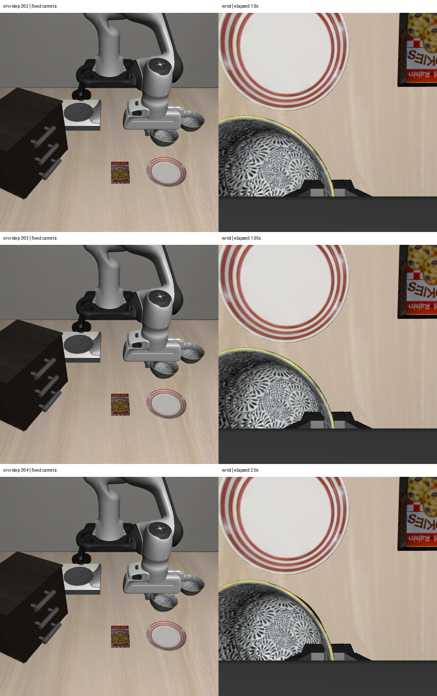

# 2026-10-07：末段逐控制步观测与跟踪敏感性复核

## 本轮确定了什么

相同抓取动作逐步重放，停留段每 0.05 秒保存一次双相机 RGB-D。**跟踪失效集中在环境步 363→364，即额外停留 1.95→2.00 秒。** 此前 1.95 秒仍有 14 个连续对应，最后一帧全部失效。

末步碗面草拟 ROI 的相邻帧深度差中位数为 **5.90 mm**，RGB 平均绝对差为 **41.19/255**；同期腕部相机平移约 **1.03 微米**、转角约 **0.00016°**，盘子与机器人 ROI 基本不变。这支持局部可见场景出现突变，不支持将失效简单归因为相机整体运动。

固定像素 ROI 的深度变化不是相同材料点的位移，不能宣称碗下落 5.9 mm。突然转动、滑移和可见表面切换仍未分离；最终持物与任务成功继续 unknown。

## 修正之前转角的解释

逐步与隔步重放的 20 组共同双相机观测逐元素相同，完整控制轨迹逐字节相同，但连续匹配依赖采样间隔。再以停留开始作为固定参考帧独立匹配，结果仍有差异：

| 同一 1.9 秒画面 | 拟合相对手部转角 | 一致点数 |
| --- | ---: | ---: |
| 每两步连续匹配 | 4.48° | 16 |
| 每步连续匹配 | 3.44° | 14 |
| 固定参考帧独立匹配 | 5.43° | 15 |

**此前 4.48° 应作为特定方法的估计，不能当已标定的物理转角。** 连续对应可能累积像素量化和纹理漂移；固定参考帧可以减轻累积误差，但也可能在重复纹理间切换。不同方法、点集、搜索半径的差异尚未做严格消融，上述范围不是统计置信区间。低刚性拟合残差不能消除对应误差。

三个方法均无法得到最终可靠刚体运动。当前可重复的事实是局部 RGB-D 随停留变化、末步发生明显局部突变；精确转动和接触处滑移量未确定。

## 相邻帧检查

| 到达的停留步 | 环境步 | 碗面 RGB 平均绝对差 | 碗面深度差中位数 |
| --- | ---: | ---: | ---: |
| 37 | 361 | 16.87/255 | 0.312 mm |
| 38 | 362 | 18.19/255 | 0.339 mm |
| 39 | 363 | 20.53/255 | 0.387 mm |
| 40 | 364 | 41.19/255 | 5.901 mm |

这些是相邻固定像素区域的变化量，没有输出 holding=true。盘子、机器人 ROI 是助手草拟的局部对照，不是完整分割真值。

## 实现与核验

新增独立逐步采集入口、逐步连续诊断和固定参考帧诊断，保留原每两步采集及其结果。新的 episode `visual_grasp_stepwise_hold_f044f28655ae48259a08bb2e726b0c94` 实际执行 **354 步控制 + 10 步静置**，保存 **56 组同步双相机观测**。

控制轨迹与原 40 步闭爪和每两步采集实验逐字节相同。当前视觉候选通过初始/预抓取双相机数据、标定和本体状态一致检查后复用，保存新 episode 与来源。17 个部署源码文件、观测与诊断哈希核验通过，服务器任务已退出。

语义目标仍是助手显式选择、未人工复核；不能当自主成功率。未用物体真值判断持物，policy/cuTAMP/正式 recovery 没有参与。传感器桥接仍使用同一对已渲染 RGB 与深度，保存动作不推进物理状态；元数据同步检查不等于完整渲染时序审计。

## 下一步

末段失效时间已经定位，暂不继续增加采集密度。下一项检查应使用固定相机/腕部的整体轮廓及三维可见表面，对突变前后作独立复核，避免只依赖重复纹理。对可确认的不稳定夹持再做夹持位置/方向单变量对照。未验收的终态不进入放置动作。

## 产物

- [末步图像、深度、相机及局部对照变化](rgbd_grasp_stepwise_frame_changes_20261007.json)
- [采样间隔与参考帧敏感性](rgbd_grasp_tracking_sensitivity_20261007.json)
- [逐步连续对应](rgbd_grasp_stepwise_motion_20261007.json)、[固定参考对应](rgbd_grasp_anchored_motion_20261007.json)
- [新重放实际结果](rgbd_grasp_stepwise_result_20261007.json)、[轨迹](rgbd_grasp_stepwise_trace_20261007.jsonl)
- [审计](rgbd_grasp_stepwise_audit_20261007.json)、[部署源码](rgbd_grasp_stepwise_source_sha256_20261007.json)

本地数据 `D:\大三上\科研\visual-grasp-stepwise-live-20261007`，诊断 `D:\大三上\科研\visual-grasp-stepwise-motion-20261007` 与 `D:\大三上\科研\visual-grasp-anchored-motion-20261007`。服务器数据 `/mnt/sdb/24_yyx/demo/visual-grasp-stepwise-live-20261007`，运行时 `/mnt/sdb/24_yyx/projects/visual-grasp-stepwise-runtime-20261007`。

源码包 SHA-256：`a4394e4e1c601a0fa6e8da0f60dc94301d30997863f2c7fda8d025a26ccb400e`。
