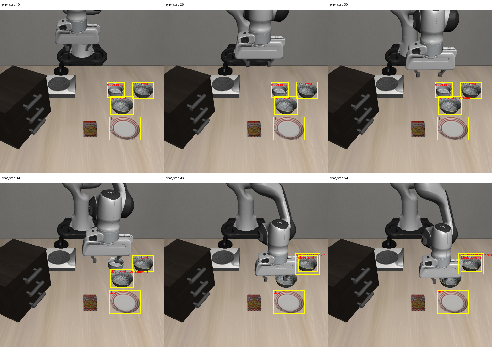

# 2026-10-04：运动段视觉失效诊断及查询方式对照

## 结论

已定位两个问题：联合提示词的混合标签被精确匹配规则丢弃，以及相似容器被重复分配多个类别。对全部 12 帧改用按类别分别查询，未恢复稳定绑定，反而每帧都出现 mask 冲突。该方式保留为显式离线实验选项，默认仍用原联合查询，未部署到服务器策略循环。

| 状态 | 原联合查询 | 分类别查询 |
| --- | ---: | ---: |
| 视觉 ID 候选 | 5 | 0 |
| 绑定拒绝 | 4 | 0 |
| 场景拒绝 | 3 | 12 |

这是同一轨迹保存观测的离线配对比较，不能作为任务成功率或识别精度。没有运行 policy、仿真或环境动作。输入仅为保存的 RGB-D 和任务语言，模型仅接收 RGB。

## 检测如何失效

第 10/26 步的原输出有两个 `black bowl`、一个 `plate`、一个 `silver ramekin`。第 30 步，目标碗附近的框仍在，但标签变成 `black bowl silver ramn`，被精确匹配丢弃，导致 `target_not_between`。第 34 步附近同时出现混合标签和参考物检测缺失，导致 `reference_not_observed`。第 46/54 步，右侧碗区域同时出现 bowl 与 ramekin 检测，SAM2 为它们产生重叠 mask，系统拒绝场景。

图中黄框与红字来自原始 Grounding DINO 输出，包括被精确匹配丢弃的标签；它们不是有效视觉实例或人工真值。展示六个选定时间点，完整逐帧标签见 JSON。



分别查询避免了提示词之间的混合标签，却增加同一对象的跨类别检测。第 10 步，将右侧碗检测为 ramekin 的分数约 0.539，高于小 ramekin 检测的约 0.493。因此直接取最高分可能保留错误类别；这些分数也不是校准后的类别正确率。

当前结果不能证明只有遮挡导致失效。可见图像支持存在机械臂遮挡，原始框和分别查询结果还支持类别混淆；两者需要通过可见区域标注进一步区分。没有降低重叠门槛、裁剪掉冲突 mask 或指定仿真物体身份。

## 本轮实现和验证

- detector 新增 `grounding_mode=per_category` 实验选项。每个查询只接受其当前类别的精确标签，不能从其他查询借用类别；保留所有原始框和 query_category 供审计。
- 默认 joint 模式保留原查询方式；单帧 CLI 仅在显式选择实验模式时将新字段加入配置，避免改变旧配置的 detector ID。
- 新增 `compare_grounding_query_modes.py`，一次加载固定模型，逐帧比较保存的 joint 检测和新 per_category 检测，使用各自独立 provider 与时序诊断。权重哈希、库版本、输入图像尺寸和基线配置均检查；实验模式有独立 detector ID。
- 修复时序回放脚本对空 binding 的处理，能够验证真实序列中的 scene_refused 帧。完整 12 帧原绑定和状态通过核对，时序结果与在线 trace 一致，浮点数仅允许 1e-12 绝对误差以容纳不同 NumPy 实现的舍入。
- 完整 unittest 627 项通过。新增检查分别查询的类别边界，以及默认联合模式保留同类别多个实例并拒绝混合标签。回放脚本随后以真实 12 帧单独验证。

模型与阈值沿用上一轮固定配置，只有查询方式变化。Guard 记录三个指定 oracle 模块的导入尝试为 0；此范围不等于所有 MuJoCo 内存访问审计。持物、目标完成及规划授权始终未通过。

## 证据和复现

- [原始联合查询标签审计](rgbd_grounding_label_audit_20261004.json)
- [逐帧配对结果及输入源码哈希](rgbd_grounding_query_comparison_20261004.json)
- [计数、产物哈希与时序核对摘要](rgbd_grounding_query_comparison_audit_20261004.json)
- [原 48 步数据的完整时序回放](rgbd_temporal_48_replay_20261004.json)

原始数据：`D:\大三上\科研\visual-policy-48-20261004`。
成功完成的对照产物：`D:\大三上\科研\rgbd-per-category-v3-20261004`。
最初两个输出目录保留为不完整尝试：第一次严格比较遇到 JSON tuple/list 差异，第二次遇到服务器与本地约 1e-16 的浮点差异，均在第 10 步停止；未计入正式 12 帧结果。

```powershell
$env:OMP_NUM_THREADS='1'; $env:MKL_NUM_THREADS='1'; $env:OPENBLAS_NUM_THREADS='1'
& 'D:\大三上\科研\.venvs\rgbd-perception\Scripts\python.exe' `
  scripts/recovery/skill_pipeline/compare_grounding_query_modes.py `
  --input-dir 'D:\大三上\科研\visual-policy-48-20261004' `
  --out-dir 'D:\大三上\科研\rgbd-per-category-new' `
  --grounding-model-dir 'D:\大三上\科研\.models-rgbd\grounding-dino-tiny' `
  --sam2-model-dir 'D:\大三上\科研\.models-rgbd\sam2.1-hiera-tiny'
```

输出目录必须未存在，在仓库根目录运行。

## 下一步

给这批保存帧补仅限可见部分的对象标注，区分目标漏检、类别错误、重复实例和遮挡程度。使用标注对改进方案做离线检查，评估有效目标与参考物是否恢复、错误实例是否减少，再决定是否做新的在线实验。候选方案包括更具区分性的视觉描述、类别核验和有可见证据约束的时序跟踪；没有证据的帧继续返回 unknown/refused。
