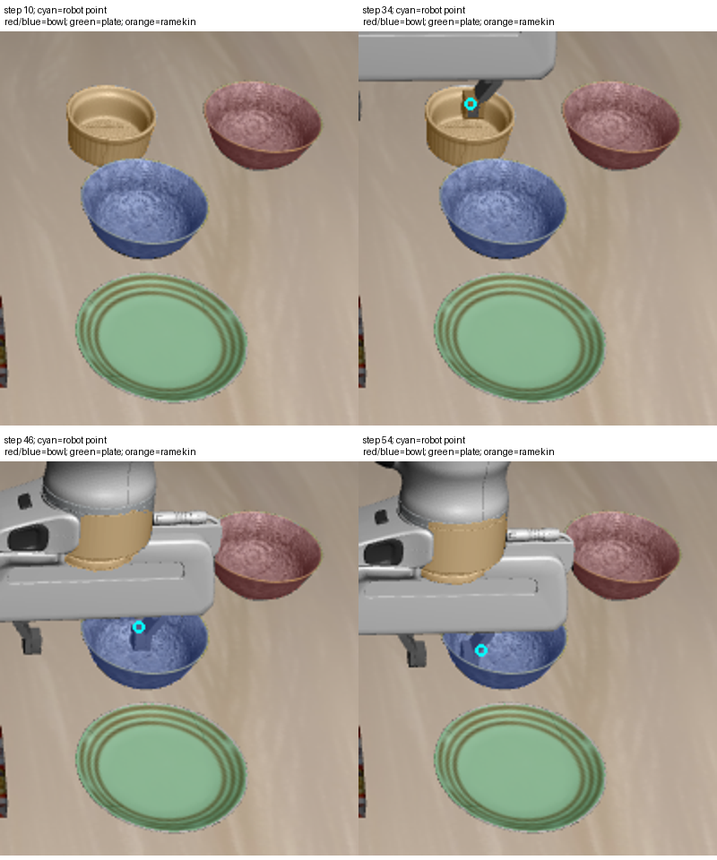

# 2026-10-04：历史框提示的当前 RGB 分割实验

## 结果

从真实轨迹第 10 步的有效检测 mask 提取四个图像框，固定这些框，对第 10–54 步的 12 张当前 RGB 重新运行冻结 SAM2。没有运动预测、递归框更新、类别重新识别或视频模型记忆。

| 本段保存观测的离线结果 | 数值 |
| --- | ---: |
| 按历史类别标号的提议覆盖草稿可见点 | 44/44 |
| 提议间全局 mask 冲突 | 0 帧 |
| 提议覆盖草稿机器人负点 | 6 帧 |
| 可见点、负类别、全局冲突及机器人负点都通过 | 6/12 帧 |
| 类别/物理身份核验、恢复执行 | 未通过 |

“44/44”是在历史类别假设下的像素点覆盖，不是当前语义分类正确率、mask IoU 或跟踪成功率。该轨迹可见对象的图像位置变化较小，固定框实验不能外推到真实搬动目标的轨迹。

历史框确实补上了原文本检测缺失的一些可见区域，但 SAM2 没有可靠区分物体与接近它的机器人。从第 34 步起，提议连续六帧覆盖可见机器人点；更后期，历史 ramekin 框直接分到机器人连杆。**本方案未接入感知 provider 或恢复流程。**

## 图像证据

颜色表示初始检测传下来的类别假设：红/蓝为两个 bowl 提议，绿为 plate，橙为 ramekin。青色点是当前原始 RGB 中目视检查的机器人负点。后期橙色区域是机器人连杆，蓝色碗区域还包含手指；颜色不表示当前类别或身份已核验。



后四帧被完全遮挡的 ramekin 继续排除出可见对象点分母，因此 44/44 无法发现它被机器人区域替代的问题。机器人负点补充揭示了这类失败。负点仍只是稀疏检查，不能当作完整机器人 mask 或误分割面积统计。

## 实现

新增 `HistoricalBoxProposal`，类别字段只表示初始检测的历史假设；category_verified、identity_verified、planning_allowed、execution_allowed 必须为 false。它不是 `VisualDetection`，当前 RGBDSceneProvider 会拒绝该类型。

实验产物使用独立的 `proposal_masks.npz` 和 `proposal_metadata.json`，没有生成可被标准检测 loader 读取的 detections 文件。元数据记录初始 snapshot、固定框、历史类别来源及 production_compatible=false。每帧分割实际读取当前 RGB，未沿用旧 mask。

脚本检查初始 detector 配置 ID、无重叠初始场景、SAM2 权重哈希和版本、模型库版本、同 episode/固定相机及标定，并将草稿正点、机器人负点与对应 RGB 哈希绑定。CPU 本地运行，没有 policy、环境动作或仿真启动。指定三个 oracle 模块导入尝试为 0；不等于所有 MuJoCo 内存访问审计。

## 标注及验证范围

沿用 44 个可见对象点草稿，另为 12 帧建立共 18 个可见机器人负点。所有点均未人工复核，标注者已看过此前模型输出，不是盲标。初版第 54 步负点在放大检查时发现落到了碗内，已移至可见手指像素，并重新完成全部分割和评估；初版结果及点文件保留，不用于最终报告。修正后六个后期帧仍全部出现机器人点覆盖。

2 项针对性测试通过：提议类型不能被正式 scene provider 接收，类别/身份/执行核验标记不能设为 true。真实 12 帧实验另完成维度、输入哈希、输出标记和源码哈希核验。未修改已有运行时模块，也未重复完整测试。

## 证据与复现

- [12 帧当前分割、点评估和机器人点命中](rgbd_historical_box_sam2_report_20261004.json)
- [汇总、机器人点命中类别和产物哈希](rgbd_historical_box_sam2_audit_20261004.json)
- [机器人负点草稿](../experiments/robot/libero/skill_pipeline/fixtures/rgbd_motion_robot_negative_points_20261004.json)

最终完整产物：`D:\大三上\科研\historical-box-sam2-v2-20261004`。初版检查图、原负点和初版报告保存在 `D:\大三上\科研\historical-box-sam2-20261004`。

```powershell
$env:OMP_NUM_THREADS='1'; $env:MKL_NUM_THREADS='1'; $env:OPENBLAS_NUM_THREADS='1'
& 'D:\大三上\科研\.venvs\rgbd-perception\Scripts\python.exe' `
  scripts/recovery/skill_pipeline/probe_historical_box_sam2.py `
  --input-dir 'D:\大三上\科研\visual-policy-48-20261004' `
  --reference-manifest experiments/robot/libero/skill_pipeline/fixtures/rgbd_motion_points_20261004/manifest.json `
  --robot-points-json experiments/robot/libero/skill_pipeline/fixtures/rgbd_motion_robot_negative_points_20261004.json `
  --sam2-model-dir 'D:\大三上\科研\.models-rgbd\sam2.1-hiera-tiny' `
  --out-dir 'D:\大三上\科研\historical-box-sam2-new'
```

在仓库根目录运行，输出目录必须未存在。

## 下一步

在当前 RGB 中独立识别机器人前景，检查能否排除手指/连杆污染，同时保留真实可见物体部分。先以这些正负点和分割图验证，再评估遮挡后的身份与类别重核验。固定历史框提议只作为离线候选，不能将初始类别或历史位置视为当前观测。
