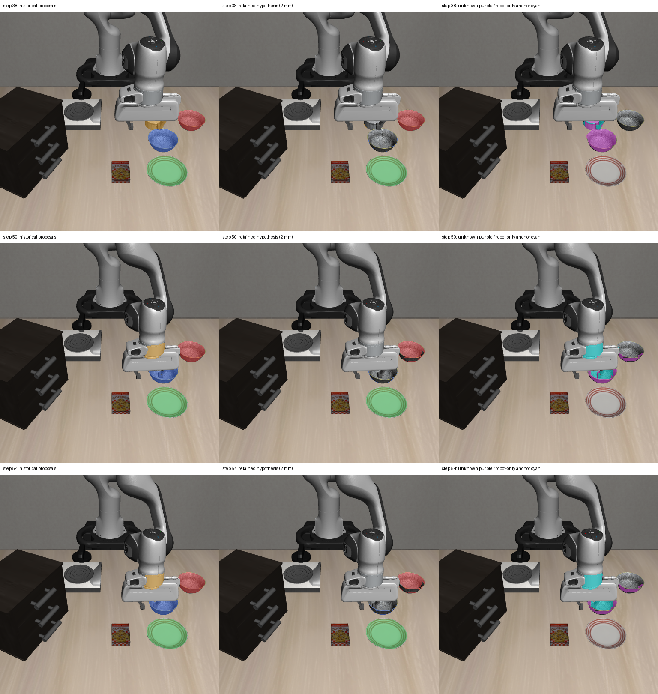

# 2026-10-04：局部深度连通与区域归属诊断

## 本轮方法

在同一真实轨迹的 12 帧中，将历史物体提议与当前 RGB 机器人候选的并集作为检查区域。对有效 optical-Z 深度采用四邻域连接：相邻像素的深度差不超过预设阈值时连通。分别运行 2、5、10 mm 阈值，报告全部配置，不选择部署配置。

对每个物体提议，使用两个来自模型 mask 的候选锚点区域：

- 物体侧：当前提议中没有被机器人候选覆盖的部分。
- 机器人侧：机器人候选中没有被任何物体提议覆盖的部分。

连通区域仅连接物体侧时，作为历史物体候选保留；仅连接机器人侧时，记录为机器人锚点假设并不保留；两侧都连接、无锚点或缺少有效深度时，记录为 unknown。**两侧锚点都不是已核验类别。** 草稿正负点不参与连通或归属计算，只用于事后评估。

## 结果

| 方法 | 独占覆盖物体草稿点 | 物体点为 unknown | 物体点仅连接机器人锚点 | 保留区域命中机器人点的帧数 | 严格点检查通过 |
| --- | ---: | ---: | ---: | ---: | ---: |
| 局部深度差 2 mm | 36/44 | 6 | 2 | 0/12 | 6/12 |
| 局部深度差 5 mm | 36/44 | 8 | 0 | 0/12 | 6/12 |
| 局部深度差 10 mm | 36/44 | 8 | 0 | 0/12 | 6/12 |

作为对照，上一轮历史深度区间诊断保留 44/44 物体点，但残留机器人点的帧数为 4/12，严格点检查为 8/12。局部连通检查减少了保留区域中的草稿机器人点，同时丢失物体点，严格点检查没有改善，因此未接入恢复。

三种配置下，未保留的 8 个对象点均为：34 步 ramekin；38 步 ramekin、前碗；42 步后碗、前碗；46、50、54 步前碗。2 mm 配置下，50/54 步前碗点被归为“仅连接机器人锚点”；5/10 mm 配置下两点转为 unknown，但都未被保留。

严格检查沿用对象独占覆盖、负类别点、全局 mask 冲突和机器人负点共同通过的规则。未知区域仍是未解决的感知输入，不能作为物体几何用于恢复。

## 图像与失败解释

每行分别为第 38、50、54 步。左列为原历史框提议，中列为 2 mm 配置保留的候选，右列紫色为 unknown、青色为仅连接机器人锚点的假设。保留候选颜色仍表示历史类别：红/蓝为两个 bowl，绿为 plate，橙为 ramekin。



实际输出揭示两类限制：

1. 像素间局部深度差较小时，可以通过一长串邻接像素连通。端点深度即使不同，也不保证分开；接触附近的区域可能同时连接两侧锚点而变为 unknown。
2. 当前机器人候选已经误覆盖物体区域。如果某个物体连通片缺少物体侧锚点，就无法从该规则恢复它，甚至会被归到机器人锚点假设。50/54 步前碗草稿点就是这种失败。

图中保留的物体部分仍有碎片和边界缺失。机器人草稿点零命中仅表示 18 个稀疏点未落入保留候选，不能证明机器人污染全部消除；36/44 也不是 mask IoU 或物体分类准确率。

## 实现及验证

- 新增独立 `local_depth_components.py`，实现四邻域 optical-Z 连通，以及保留/机器人锚点假设/unknown 三种互斥像素划分。
- 新增离线 `probe_local_depth_components.py`，对 12 帧、3 种阈值共 36 组检查保存连通标签、三种区域 mask、来源信息和点评估。
- 4 项针对性测试通过：深度断层分离锚点，两侧同时连接与无锚点保持 unknown，无效深度和对角像素不能桥接，以及渐变链的传递连通行为。
- 所有输入和源码哈希已复核；36 组输出的三种像素区域互斥且并集等于原提议，核验/执行标记保持 false。产物哈希和每个对象点的连通片 ID、两侧锚点像素数另存审计文件。

全部提议仍为未核验的 `HistoricalBoxProposal`，production_compatible=false，未改默认 provider、adapter、runner 或执行路径。没有 policy 推理和环境动作，指定三个 oracle 模块的导入尝试为 0；该 guard 不是任意仿真内存访问审计。

沿用助手目视草稿点，尚未人工复核，标注者看过此前模型输出，不是盲标；后四帧遮挡的 ramekin 不计入对象点分母。此次没有新 rollout，也不能确认持物、类别连续性、接触或任务成功。

## 数据与复现

- [36 组检查和完整配置](rgbd_local_depth_components_report_20261004.json)
- [输入源码核验、像素划分检查及逐点连接原因](rgbd_local_depth_components_audit_20261004.json)
- 完整产物：`D:\大三上\科研\local-depth-components-20261004`。

在仓库根目录运行，输出目录必须未存在：

```powershell
& 'D:\大三上\科研\.venvs\vla-dev\Scripts\python.exe' `
  scripts/recovery/skill_pipeline/probe_local_depth_components.py `
  --depth-report 'D:\大三上\科研\robot-depth-compatibility-20261004\report.json' `
  --input-dir 'D:\大三上\科研\visual-policy-48-20261004' `
  --proposal-root 'D:\大三上\科研\historical-box-sam2-v2-20261004' `
  --robot-root 'D:\大三上\科研\rgb-robot-foreground-20261004' `
  --reference-manifest experiments/robot/libero/skill_pipeline/fixtures/rgbd_motion_points_20261004/manifest.json `
  --robot-points-json experiments/robot/libero/skill_pipeline/fixtures/rgbd_motion_robot_negative_points_20261004.json `
  --out-dir 'D:\大三上\科研\local-depth-components-new'
```

## 下一步

当前固定视角的文本分割、历史深度区间及局部深度连接均未提供可靠的机械臂/容器分离。下一步优先检查已保存的同步腕部视角能否观测同一重叠区域，并通过标定投影提供独立可见性证据。跨视角也无法区分的区域继续保持 unknown；需要人工复核与新的实际搬动物体序列验证。
