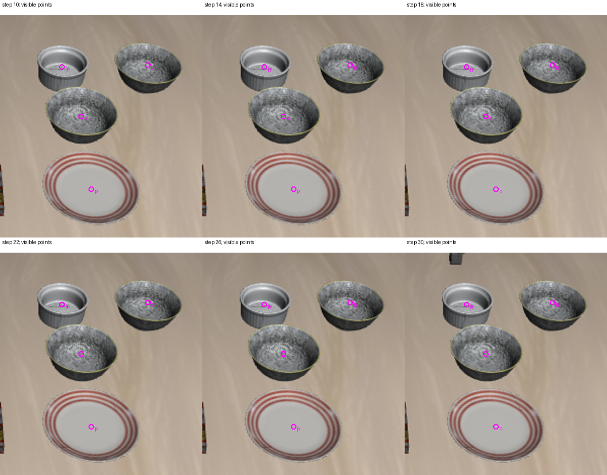
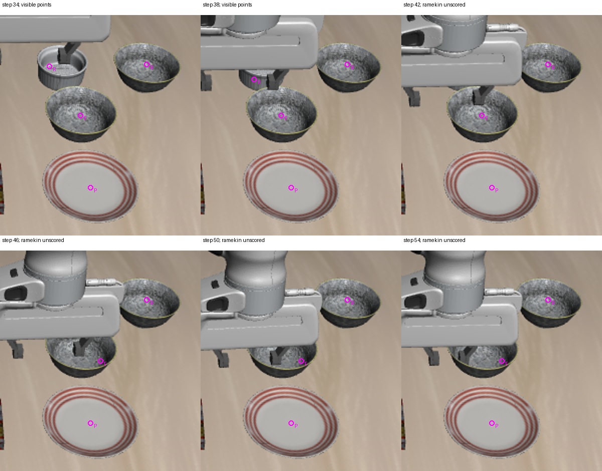

# 2026-10-04：真实运动段可见点标注与评估

## 本轮完成

对 48 步真实 Pi0 轨迹的 12 次查询，逐帧查看原始 RGB 裁剪，建立 44 个可见对象内部像素点及对应负类别检查。每帧包含前后两个碗和盘子；前 8 帧另标 ramekin，后 4 帧因机器人遮挡、无法可靠确认可见部分，将 ramekin 记为 unscored，排除出漏检分母。

**这些是助手目视检查的草稿，尚未经人工复核。** 标注时已经看过检测结果，不是盲标或独立测试集；只用于本轨迹诊断。没有标注隐藏表面、完整物体 mask、接触或仿真真值，也没有把参考类别注入运行时感知。当前检查不代表 mask IoU、实例分割精度或任务成功率。

## 配对结果

模型、提示词、阈值和保存帧沿用上轮；本轮只评估缓存的 mask，没有重新推理或执行环境动作。

| 44 个草稿可见点 / 12 帧 | 联合查询 | 分类别查询 |
| --- | ---: | ---: |
| 恰好一个正确类别 mask 覆盖点 | 35 | 41 |
| 只有一个正确类别 mask，且没有其他 mask 覆盖点 | 32 | 14 |
| 点被其他类别 mask 覆盖 | 3 | 27 |
| 正确类别缺失 | 9 | 3 |
| 整帧通过所有可见点、负点及重叠检查 | 5 | 0 |
| 存在全局 mask 冲突的帧 | 3 | 12 |

“正确类别覆盖”可能同时存在错误类别覆盖，因此 41/44 不能单独用来判断方案更好。分别查询提高了点覆盖，却显著增加混淆，仍不适合替换默认方案。点级独占正确也不能证明完整实例边界正确；合并实例及全局 mask 冲突另行检查。

联合查询的 9 个缺失为：第 30–54 步的前方碗共 7 次，以及第 34/38 步部分可见的 ramekin 共 2 次。第 42–54 步无法可靠确认可见的 ramekin 没有计为漏检。分别查询仅缺第 38 步 ramekin、第 46/50 步前方碗，但仍因跨类别重复分割而全部拒绝。

## 可复核标注

紫色点及字母：R=ramekin、B=后方碗、F=前方碗、P=plate。图仅显示原始 RGB 裁剪及草稿点；原始坐标、RGB SHA-256 和可见状态在 JSON 中。后期前方碗的点选在未被手指遮挡的区域，不从检测 mask 中选择。点位置按 RGB 检查，仍需要人工复核。





标注目录：`experiments/robot/libero/skill_pipeline/fixtures/rgbd_motion_points_20261004`，包含 manifest 和 12 个逐帧 JSON。全部文件明确标记 `assistant_visual_draft_requires_human_review`，并与对应 episode、step、camera、图像尺寸及 RGB 哈希绑定。

## 实现与验证

评估器新增独占正确点和其他类别覆盖计数。即使全局 mask 重叠未达到冲突门槛，只要同一参考点被错误类别 mask 覆盖，点检查也不能通过。这只改变离线参考评估的通过条件，未改变运行时 scene admission 的重叠门槛。

新增序列评估脚本，读取冻结检测、校验逐帧 detector 配置与身份、检查重复 frame/reference ID，记录未评分实例及输入哈希。指定 oracle 模块导入尝试为 0；没有 policy、模拟器或动作。相关 4 项测试通过，覆盖冲突覆盖、缺失点、正常独占点、负类别错误，以及低于全局重叠门槛的错误类别覆盖。本轮未重复运行上轮已经通过的 627 项完整测试。

## 证据与复现

- [逐帧点评估、未评分实例和输入哈希](rgbd_motion_point_evaluation_20261004.json)
- [汇总、标注及源码哈希](rgbd_motion_point_evaluation_audit_20261004.json)
- [标注 manifest](../experiments/robot/libero/skill_pipeline/fixtures/rgbd_motion_points_20261004/manifest.json)

```powershell
& 'D:\大三上\科研\.venvs\vla-dev\Scripts\python.exe' `
  scripts/recovery/skill_pipeline/evaluate_motion_point_references.py `
  --data-root 'D:\大三上\科研\visual-policy-48-20261004' `
  --candidate-root 'D:\大三上\科研\rgbd-per-category-v3-20261004' `
  --reference-manifest experiments/robot/libero/skill_pipeline/fixtures/rgbd_motion_points_20261004/manifest.json `
  --out-file 'D:\大三上\科研\rgbd-motion-points-new.json'
```

在仓库根目录运行，输出文件必须未存在。完整审阅图及评估结果另保存在 `D:\大三上\科研\rgbd-motion-references-20261004`；该目录的 point_evaluation_v2.json 为本轮最终结果，早期 point_evaluation.json 为增加点级独占通过条件之前的结果，此轨迹数值相同。

## 下一步

利用这批可复核草稿筛查新的视觉描述或类别核验方案，要求同时改善目标点覆盖和减少错误类别覆盖。随后扩大到独立轨迹、由人工复核标注，才能讨论更可靠的泛化指标。持物、支撑与目标完成核验仍需额外证据，恢复执行继续禁止。
