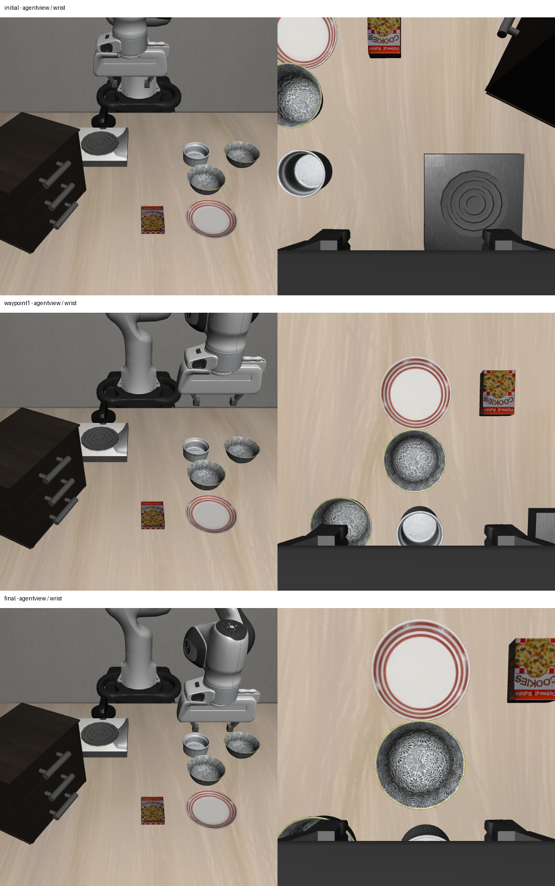

# 2026-10-04：首次 RGB-D 驱动预抓取接近实测

## 这次打通了什么

在个人服务器上实际运行了一个独立仿真入口：**当前 RGB-D → 助手显式选择目标候选 → 视觉路点生成 → OSC 实际动作 → 每步本体反馈 → 新 RGB-D 与位置误差验收**。

选定 LIBERO Spatial task 0、init 1、seed 11，任务为将 plate 与 ramekin 之间的 black bowl 放到 plate 上。本轮仅验证恢复动作中的预抓取接近段：从初始末端位置移动到所选可见区域上方，始终发送开爪指令；没有下降到抓取位、闭合、抬升物体或放置。

目标选择为助手检查当前 RGB 后显式指定前侧 bowl mask（原检测索引 1），不是自动语言目标核验，也不是人工复核标签。报告保留 `human_reviewed=false`、`identity_verified=false`。这一步将感知选错与控制接不通的问题暂时分开，不能作为自主恢复成功率。

## 结果：保留首轮失败和重跑

| 实际仿真尝试 | 控制预算 | 实际控制步 | 路点到达 | 最终预抓取误差 |
| --- | ---: | ---: | --- | ---: |
| 首轮 | 80 | 80 | 初始高位到达；横向未到达，未下降 | 105.2 mm |
| 同条件重跑 | 160 | 126 | 三个路点全部到达 | **7.6 mm** |

验收阈值预先设为 8 mm。首轮预算用完时，横向路点还差 19.4 mm；当前保守控制指令下实际位移约为 2.5 mm/步，因此未进入下降段。重跑仅增加预算，保留相同动作尺度、增益、目标生成规则、task/init/seed。

两轮初始固定相机 RGB、深度、标定已核验逐元素一致。重跑复用完全相同当前 RGB 的冻结检测 mask，并在新 episode 保存新的观测关联与缓存来源，未把旧 episode 的身份当成新 episode 的身份。两轮合计 206 个接近控制动作、20 个静置动作，policy 动作为 0。

这是一次已达成的视觉控制接近 canary，**没有完成 grasp、完整 recovery 或 LIBERO 任务**。正式 runner/VLA 触发的 recovery 仍未接通，cuTAMP 本轮没有参与。

## 视觉目标和控制方法

本轮当前帧在静置 10 步后采集，双相机 512×512。冻结 GroundingDINO + SAM2 使用此前相同提示配置，产生 4 个候选，detector ID 为 `grounded-sam2-a62b7dbfbf7a`。助手查看原图和候选叠图后选择前侧 bowl。

所选 mask 有 **2993 个有效深度点**。按已保存相机内外参反投影，以可见点 XY 中位数和可见 Z 的 95 分位数上方 12 cm 生成预抓取点：

```text
goal_world_m = [-0.0845568642, 0.2017697608, 1.0696375683]
visible_z_percentile95_m = 0.9496375683
initial_eef_world_m = [-0.2068508499, -0.0223248190, 1.1739812715]
```

路点依次为当前 XY 的较高 Z、目标 XY 的相同较高 Z、目标预抓取点。位置和总位移通过声明的仿真 canary 工作范围检查，不宣称完整碰撞模型或运动路径无碰撞。

执行时核对当前控制器为 OSC_POSE、delta 模式、平移 output 范围 ±0.05 m。每步从白名单末端位置计算误差，平移控制为 `clip(0.5 * error / 0.05, -0.2, 0.2)`，转动输入为 0，开爪输入为 -1。指令平移尺度与实际每步位移并不相等，因此根据实际轨迹修正预算。

位置到达依据末端本体观测，不使用环境 reward、任务 `done`、物体位姿或接触状态。环境返回的 done 仅单独记录，未用于控制成功或抓取验收。接近期间没有根据中途 RGB-D 重新定位目标；目标固定为动作前当前帧选定的可见区域。后续目标移动时需要重新观测和重规划。

## 实际观测

三行分别为初始、横向路点到达后、第 126 个控制动作后的终态；左为固定相机，右为腕部相机。图像未叠加 oracle 物体状态。



终态保存于环境步 136；同帧位置误差重算为 0.0076120406 m。图像和本体误差支持本次接近段已经执行及到达预抓取点，不支持持物、接触或任务完成。

## 实现与核验

- 新增 `visual_pregrasp_control.py`：只接受 RGBDObservation 和显式 bool mask；拒绝缺深度、无效数值、超出当前 canary 范围的目标。目标几何生成不接受环境或 SceneState。
- 新增 `run_visual_pregrasp_canary.py`：独立建立仿真，发布当前观测并等待匹配 episode/step/RGB 哈希的 mask；执行有预算的反馈控制，保存每步动作、位置误差及初始/路点/终态双相机观测。
- 4 项针对性测试通过：当前深度目标和分段路点、缺深度/非视觉输入拒绝、平移限幅及开爪指令、反馈收敛到位置阈值。
- 两轮轨迹均核对每步连续编号、7 维有限动作、平移限幅、转动为 0、开爪指令和相邻位置连续性；重算最终误差与视觉目标一致。
- 双相机观测逐组核对同步，保留首轮和重跑全部产物哈希。部署包 11 个源码文件哈希已核对，首轮旧包及重跑新包分别保存。
- 两轮 worker 和 tmux 已退出，未留下仿真后台任务。

第一次打包遗漏 package 初始化依赖，进程在环境创建前退出；补齐依赖后才有表中的两次动作实验。最初本地检测调用缺少 prompts 文件，创建明确提示文件后完成模型推理，未因此启动额外仿真动作。

指定三个 oracle 模块的导入拦截尝试均为 0；该 guard 不等于任意内存访问审计。仿真本身仍使用物理引擎，传感器 adapter 使用相机标定、深度与时间；本轮不读取场景物体真值用于目标生成或成功判断。控制器配置检查和底层机器人控制不等于物体状态感知。

## 当前缺口和下一步

当前完成的是控制端的第一段集成，目标身份、完整物体几何、整臂碰撞检查和抓取验收均未核验。旧视觉诊断接口仍然拒绝动作，本入口没有将 `planning_allowed=false` 改成 true 来绕过它，也没有构造伪造的旧 SceneState。

下一步在这个同一任务上，根据新预抓取观测生成明确的抓取候选，再验证下降/闭合/小幅抬升和独立视觉持物证据。若候选不足，记录具体缺少的几何或可见性，而不是以本次位置到达代替抓取成功。完整 cuTAMP/skill/VLA 触发的 recovery 集成和自动语义绑定仍需后续实现。

## 产物

- [首轮未达成结果](rgbd_pregrasp_first_result_20261004.json)
- [重跑已到达结果](rgbd_pregrasp_live_result_20261004.json)
- [首轮 80 步动作轨迹](rgbd_pregrasp_first_trace_20261004.jsonl)
- [重跑 126 步动作轨迹](rgbd_pregrasp_live_trace_20261004.jsonl)
- [观测、动作、源码及产物审计](rgbd_pregrasp_live_audit_20261004.json)
- [重跑部署源码清单](rgbd_pregrasp_source_sha256_20261004.json)，[首轮部署源码清单](rgbd_pregrasp_first_source_sha256_20261004.json)。
- 本地完整数据：`D:\大三上\科研\visual-pregrasp-live-20261004` 和 `D:\大三上\科研\visual-pregrasp-live-v2-20261004`。
- 服务器完整数据：个人目录 `/mnt/sdb/24_yyx/demo/visual-pregrasp-live-20261004` 和 `/mnt/sdb/24_yyx/demo/visual-pregrasp-live-v2-20261004`。
- 重跑运行时：`/mnt/sdb/24_yyx/projects/visual-pregrasp-runtime-v3-20261004`，源码包 SHA-256：`aac35fbaabaa1b773a0b035c4386e7f4d52864f6660f8f05c7e9d167de3f16a0`。
