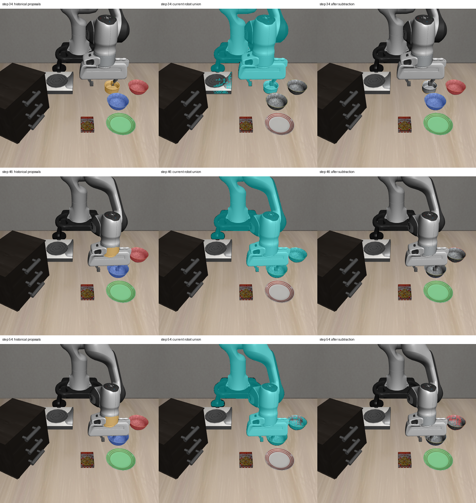

# 2026-10-04：当前 RGB 机器人前景扣除对照

## 结果

已对真实 Pi0 轨迹的 12 帧进行离线对照：冻结 GroundingDINO + SAM2 以 `robot arm` 从每张当前 RGB 检测、分割机器人，将所有机器人候选 mask 取并集，再从上一轮固定历史框分割提议中扣除。模型和扣除过程不读取草稿点，点只用于事后检查。

| 草稿点检查 | 扣除前 | 扣除后 |
| --- | ---: | ---: |
| 历史类别假设下独占覆盖可见物体点 | 44/44 | 34/44 |
| 物体提议包含机器人负点的帧数 | 6/12 | 0/12 |
| 所有严格点条件通过的帧数 | 6/12 | 6/12 |

当前机器人候选并集覆盖全部 18 个草稿机器人点，也覆盖并误删了 10 个可见物体点。全部误删出现在第 34–54 步：34 步 ramekin；38 步 ramekin、前碗；42/46/50 步前碗和后碗；54 步前碗。**直接扣除没有改善严格点检查通过帧数，暂不接入恢复流程。**

扣除后的严格检查要求同时满足可见对象独占覆盖、负类别点与全局 mask 冲突检查、机器人点全部被当前机器人候选覆盖、物体提议不再命中机器人点，以及没有可见物体点被机器人候选覆盖。上述检查不是像素级分割准确率、物理身份核验或任务成功率。

## 图像证据

每行分别为第 34、46、54 步，左列是原历史框提议，中列青色为当前 RGB 机器人候选并集，右列是扣除后的提议。红/蓝为历史碗类别假设，绿为 plate，橙为 ramekin；这些颜色不表示当前类别或身份已确认。



机器人候选在接近物体时把容器也包含进去。第 46 步两只碗的大片可见区域被扣除，第 54 步前碗也受影响。这解释了为什么机器人点命中归零，同时物体点覆盖下降。第 54 步后碗仍有部分像素被误分，但其单个检查点未被覆盖，说明稀疏点会漏掉面积层面的错误。

## 实现与证据范围

- 新增 `subtract_robot_proposal`，只对独立 `HistoricalBoxProposal` 做 mask 差集；输入不被修改，完全为空的提议被删除，类别、身份、规划和执行核验标记保持 false。
- 新增独立离线脚本 `probe_rgb_robot_foreground.py`，检查输入 episode/step/camera、RGB 哈希、提议格式、库版本和冻结模型权重。机器人检测单独保存；过滤后的历史提议使用独立格式，production_compatible=false，不能据此作为已验证物体提交给正式 provider。
- 4 项针对性测试通过：正式 provider 拒绝历史提议、禁止升级核验标记、差集不修改原数据且删除空提议、机器人 mask 需为对齐的二维布尔数组。
- 12 帧实际运行完成，输入及源码哈希重新核对，72 个输出文件记录哈希。没有 policy 推理或环境动作，指定三个 oracle 模块的导入尝试为 0；这不是任意仿真内存访问审计。默认 adapter、runner 与 recovery 执行路径没有接入本轮方案。

所有对象点和机器人点仍为助手目视草稿，未人工复核，标注者已看过检测输出，不是盲标或独立真值。遮挡的 ramekin 在后四帧不计入对象点分母；18 个机器人点不能替代完整机器人分割标注。即便点检查通过，也不能证明类别连续性、持物、接触或放置完成。

## 数据与复现

- [逐帧报告及配置、输入源码哈希](rgbd_rgb_robot_foreground_report_20261004.json)
- [输出哈希与逐帧误删对象](rgbd_rgb_robot_foreground_audit_20261004.json)
- 完整数据：`D:\大三上\科研\rgb-robot-foreground-20261004`。
- 历史提议输入：`D:\大三上\科研\historical-box-sam2-v2-20261004`。

在仓库根目录运行，输出目录必须未存在：

```powershell
$env:OMP_NUM_THREADS='1'; $env:MKL_NUM_THREADS='1'; $env:OPENBLAS_NUM_THREADS='1'
& 'D:\大三上\科研\.venvs\rgbd-perception\Scripts\python.exe' `
  scripts/recovery/skill_pipeline/probe_rgb_robot_foreground.py `
  --input-dir 'D:\大三上\科研\visual-policy-48-20261004' `
  --proposal-root 'D:\大三上\科研\historical-box-sam2-v2-20261004' `
  --reference-manifest experiments/robot/libero/skill_pipeline/fixtures/rgbd_motion_points_20261004/manifest.json `
  --robot-points-json experiments/robot/libero/skill_pipeline/fixtures/rgbd_motion_robot_negative_points_20261004.json `
  --grounding-model-dir 'D:\大三上\科研\.models-rgbd\grounding-dino-tiny' `
  --sam2-model-dir 'D:\大三上\科研\.models-rgbd\sam2.1-hiera-tiny' `
  --out-dir 'D:\大三上\科研\rgb-robot-foreground-new'
```

## 下一步

优先检查机器人候选与物体重叠的深度分布，判断当前 RGB-D 能否提供区域分离证据，并将无法区分的部分保留为 unknown。继续沿用对象正点和机器人负点双侧检查；不要把文本机器人分割并集直接当成可靠排除区域。随后需要人工复核或独立序列标注，验证面积层面的误删和遮挡后的身份重核验。
