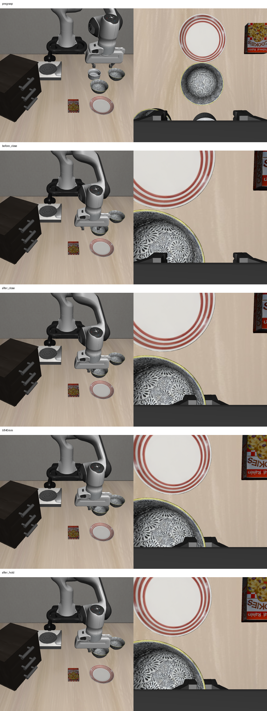

# 2026-10-04：RGB-D 碗沿抓取与小幅抬升实测

## 本轮结论

在 LIBERO Spatial task 0、init 1、seed 11 上，独立仿真入口实际执行了 **270 个控制动作**：预抓取接近、碗沿对齐、下降、闭爪、分段抬升和短暂停留。预抓取三个路点全部到达；后续五个位置路点误差均不超过 3 mm。闭爪后到停留结束，末端实际上升 **37.3 mm**。

**这说明 RGB-D 生成的候选已经驱动机械臂完成一次抓取尝试，尚不能确认抓住目标。** 固定相机在五个检查帧中都漏检了前侧目标碗，检测到的 bowl 是后方另一个碗；不能据此计算目标高度变化。保存结果仍为 `holding_verified=false`、`identity_verified=false`、`task_success_verified=false`。false 在这里表示没有核验通过，不能反推已经证实抓取失败。

本轮没有放置，也没有正式 VLA 触发的 recovery 集成或 cuTAMP 规划。助手显式选择视觉候选，`human_reviewed=false`；这不是盲测，也不能计入自主恢复成功率。

## 如何执行

1. 双相机采集 512×512 RGB-D，先静置 10 步。初始图像与上一轮完全相同，复用冻结检测 mask，并核对当前 episode、步号、RGB 哈希及缓存来源。
2. 实际完成 126 步预抓取接近，在环境步 136 保存新 RGB-D。对该图像运行冻结 GroundingDINO + SAM2；选定前侧 bowl 候选。新 episode 的预抓取图像与前次终态逐像素相同，因此复用该新推理结果并记录来源。
3. 从当前候选的 2996 个有效深度点反投影，取高处且沿夹爪闭合方向靠近的一侧，得到 68 个碗沿候选点。使用已核对的静态 PandaGripper XML：手部 Y 为闭合轴，指垫中心相对 grip_site 的本地 Z 偏移为 -3.6 mm。计划指垫位于可见碗沿以下 10 mm。这是几何假设，未确认物理接触或完整夹持可行性。
4. 保持原朝向，先横向对齐，再下降。每步依据白名单末端本体位置反馈，平移指令限幅 ±0.2、转动为 0，位置误差阈值 3 mm。
5. 两个位置均到达后执行 16 步闭爪指令；以闭爪后的实际末端位置为起点，依次抬升 5、20、40 mm；执行 8 步停留，保存全部轨迹与双相机观测。

目标生成只使用当前 RGB-D、相机标定、本体状态和静态机器人结构。未用场景物体位姿或接触真值判定抓取；环境 reward 不进入决策，done 仅记录。三个指定 oracle 模块的导入拦截尝试为 0，这不是任意仿真内存访问审计。

## 动作结果

| 阶段 | 实际控制步 | 位置验收 |
| --- | ---: | --- |
| 预抓取三个路点 | 126 | 三个均到达，阈值 8 mm |
| 碗沿横向对齐 | 28 | 2.72 mm |
| 下降到夹持候选 | 60 | 2.80 mm |
| 闭爪 | 16 | 仅记录指令与本体状态 |
| 抬升至 5 mm | 5 | 2.66 mm |
| 抬升至 20 mm | 13 | 2.68 mm |
| 抬升至 40 mm | 14 | 3.00 mm，未四舍五入值 2.996 mm |
| 短暂停留 | 8 | 保存终态，不判定持物 |

270 步不含 10 步静置，policy 动作为 0。末端实际升高不是物体升高；夹爪开度也不是持物证据。

下图依次为预抓取、下降后闭爪前、闭爪后、40 mm 抬升路点、停留结束；左为固定相机，右为腕部相机。

## 视觉验收暴露的问题

对 `before_close`、`after_close`、`lift20mm`、`lift40mm`、`after_hold` 五个固定相机当前帧分别重新运行冻结检测，并用静态夹爪模型投影与 5 mm 深度一致性去除机器人候选像素。它们每帧只得到后侧 bowl、plate 和与后侧 bowl 重叠的 ramekin 候选，均未检出前侧目标。目标对应关系是助手结合原图和候选位置检查的结论，没有人工真值标注。

固定相机目标区域受到夹爪遮挡，当前检测无法保持目标候选。腕部原图仍提供可检查的局部外观，但仅凭外观相似、闭爪开度或疑似随动不能确认物体身份及稳定持物。没有把后侧 bowl 的稳定高度误算成前侧目标的运动，也没有因漏检切回物体真值。

下一步应在这组已有连续观测上实现并检查目标局部的跨相机跟踪和 RGB-D 运动证据，区分目标与机器人像素；证据不足保持 unknown，并加入重新观察动作。持物验收通过后，才在相同任务增加放置与任务关系验收。无需继续调已有位置控制阈值来代替持物证据。

## 测试与可复核产物

7 项针对性测试通过，覆盖本轮碗沿坐标、xyzw 四元数、无效姿态拒绝和此前预抓取控制。动作审计核对 270 行连续编号、阶段数量、限幅、朝向输入、开闭爪指令、路点误差、13 组双相机同步、两次选择的当前观测与 mask 文件哈希，以及部署 13 个源码文件哈希。审计通过不等于持物成功。

- [实际运行结果](rgbd_rim_grasp_live_result_20261004.json)
- [270 步轨迹](rgbd_rim_grasp_live_trace_20261004.jsonl)
- [动作与观测来源审计](rgbd_rim_grasp_live_audit_20261004.json)
- [固定相机五帧检测诊断](rgbd_rim_grasp_evaluation_20261004.json)
- [部署源码清单](rgbd_rim_grasp_source_sha256_20261004.json)
- [离线诊断脚本原样留档](rgbd_rim_grasp_evaluation_source_20261004.py.txt)：路径固定于本次实验；后处理没有环境动作，其哈希已保存在诊断报告中。

完整数据在 `D:\大三上\科研\visual-rim-grasp-live-20261004`，离线检测在 `D:\大三上\科研\visual-rim-grasp-evaluation-20261004`。服务器原始数据在个人目录 `/mnt/sdb/24_yyx/demo/visual-rim-grasp-live-20261004`；运行时为 `/mnt/sdb/24_yyx/projects/visual-rim-grasp-runtime-20261004`。仿真 worker 和 tmux 已退出。

源码部署包 SHA-256：`f41bb5196804d0a94b0fa1f2581c3269812496b3f651ce2bb0ca8eb9303a37d2`。
