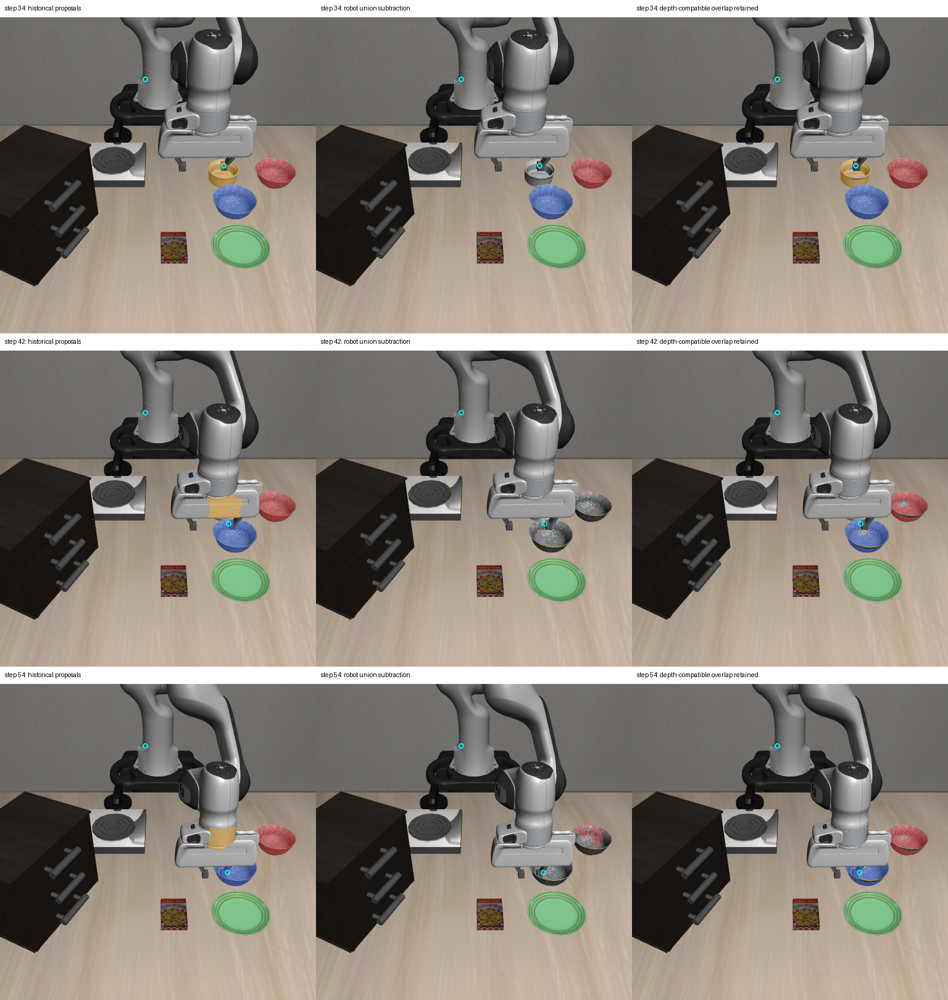

# 2026-10-04：机器人与物体重叠区域的深度诊断

## 本轮做了什么

上一轮直接扣除当前 RGB 的机器人候选并集，误删了 10 个可见物体草稿点。本轮对相同 12 帧增加离线深度兼容检查：以第 10 步每个历史物体提议中有效 optical-Z 深度的 5%–95% 分位区间为参考；对当前提议与机器人候选重叠的像素，只有深度有效且落在该历史区间内，才在诊断输出中保留。没有机器人候选覆盖的像素保持原提议状态。

预先固定四种区间扩展量：0、10、20、40 mm。所有配置都报告，没有选取部署阈值。草稿正负点只用于事后评估，不参与区间计算或像素选择。未训练模型、重新运行策略或执行恢复动作。

## 实测结果

| 方法 | 独占覆盖对象草稿点 | 残留机器人草稿点的帧数 | 严格点检查通过 |
| --- | ---: | ---: | ---: |
| 原历史框提议 | 44/44 | 6/12 | 6/12 |
| 直接扣除 RGB 机器人候选 | 34/44 | 0/12 | 6/12 |
| 历史深度兼容，扩展 0 mm | 44/44 | 4/12 | 8/12 |
| 历史深度兼容，扩展 10 mm | 44/44 | 4/12 | 8/12 |
| 历史深度兼容，扩展 20 mm | 44/44 | 4/12 | 8/12 |
| 历史深度兼容，扩展 40 mm | 44/44 | 4/12 | 8/12 |

深度检查在这段缓存轨迹中保留了全部 44 个对象草稿点，并排除了第 34、38 步的机器人负点，但第 42、46、50、54 步各残留一个手指点。四种扩展量的稀疏点指标相同，不表示输出 mask 完全相同或阈值已经确定。

严格点检查要求所有对象、负类别点与全局冲突检查通过，同时提议不包含任何机器人负点。深度诊断不会确认机器人语义、类别、持物、物理身份或任务完成。

## 为什么后四帧仍失败

第 10 步前碗提议的 optical-Z 区间为 **0.94564–1.02540 m**，区间跨度约 79.76 mm。后四帧的草稿手指点深度均落在其中：

| 环境步 | 手指草稿点 optical-Z | 当前前碗草稿点 optical-Z |
| --- | ---: | ---: |
| 42 | 1.02062 m | 1.02296 m |
| 46 | 0.94889 m | 0.99768 m |
| 50 | 0.96603 m | 0.99768 m |
| 54 | 1.01693 m | 0.99749 m |

特别是第 42 步两个点仅相差约 2.33 mm。机器人与容器在视线方向的深度可以相近，整物体的深度范围也较宽，因此历史区间不能提供可靠的机器人/物体分类依据。第 34、38 步的机器人点较靠近相机，深度分别为 0.83506、0.86837 m，才被这个区间检查排除。

这只是单像素 optical-Z 对比，不是物体间三维距离、接触间隙或传感器误差估计。区间依赖初始提议，物体真的移动时可能离开历史深度范围；当前轨迹不足以验证搬动后的泛化。

## 对照图

每行为第 34、42、54 步；左列原历史框提议，中列直接扣除机器人候选，右列保留深度兼容重叠区域（扩展量 0 mm）。青色圆圈为机器人负点。红/蓝/绿/橙表示历史类别假设，不代表当前身份已确认。



第 34 步恢复了可见小容器区域，右图机器人检查点不在提议中；第 42、54 步恢复可见碗区域时，部分手指也被保留。图中物体还存在边缘被误删的情况，44/44 个稀疏点不能替代像素级分割检查。

## 代码、验证和限制

新增独立脚本 `probe_robot_depth_compatibility.py`，输出四种配置的逐帧 mask、元数据、分位区间、原始点评估深度及汇总。使用当前有效深度、固定相机 K/T 与标定版本；逐帧核对前轮保存观测哈希、提议 RGB/episode/step/camera 来源和参考点 RGB。全部输入及源码哈希已复核，输出产物记录 SHA-256。

3 项针对性测试通过：无效/非有限/非正深度不能保留重叠像素，初始统计排除无效值并要求最少有效像素，非法区间/扩展量/有效数组尺寸会拒绝。未重复运行完整测试。

产物依然是独立 `HistoricalBoxProposal`，所有类别、身份、规划、执行标记为 false，production_compatible=false。保存格式不是标准物体检测产物；默认 provider、adapter、runner、恢复执行均未改动。policy 推理与环境动作均为 0，指定三个 oracle 模块的导入尝试为 0，此检查不涵盖任意仿真内存访问。

所有 44 个对象点及 18 个机器人点仍是助手目视草稿，未经人工复核，标注者看过先前检测输出，不是盲标或独立真值。后四帧遮挡的 ramekin 不计入对象点分母。结果仅支持继续研究深度分离，**不能据此授权执行或宣称 RGB-D recovery 已完成**。

## 证据与复现

- [全部配置、逐帧评估及点评估深度](rgbd_robot_depth_compatibility_report_20261004.json)
- [输入源码核对及输出产物哈希](rgbd_robot_depth_compatibility_audit_20261004.json)
- 完整产物：`D:\大三上\科研\robot-depth-compatibility-20261004`。

在仓库根目录运行，输出目录必须未存在：

```powershell
& 'D:\大三上\科研\.venvs\vla-dev\Scripts\python.exe' `
  scripts/recovery/skill_pipeline/probe_robot_depth_compatibility.py `
  --input-dir 'D:\大三上\科研\visual-policy-48-20261004' `
  --proposal-root 'D:\大三上\科研\historical-box-sam2-v2-20261004' `
  --robot-root 'D:\大三上\科研\rgb-robot-foreground-20261004' `
  --reference-manifest experiments/robot/libero/skill_pipeline/fixtures/rgbd_motion_points_20261004/manifest.json `
  --robot-points-json experiments/robot/libero/skill_pipeline/fixtures/rgbd_motion_robot_negative_points_20261004.json `
  --out-dir 'D:\大三上\科研\robot-depth-compatibility-new'
```

## 下一步

检查重叠区域的局部深度连续性与邻域连接，判断是否有比整物体历史深度区间更强的当前分离证据。与机器人/物体都兼容的区域应保持 unknown，不能因深度相近自动归回物体。后续需要人工复核及独立运动序列，特别是目标真正搬动和手指靠近目标的情况。
