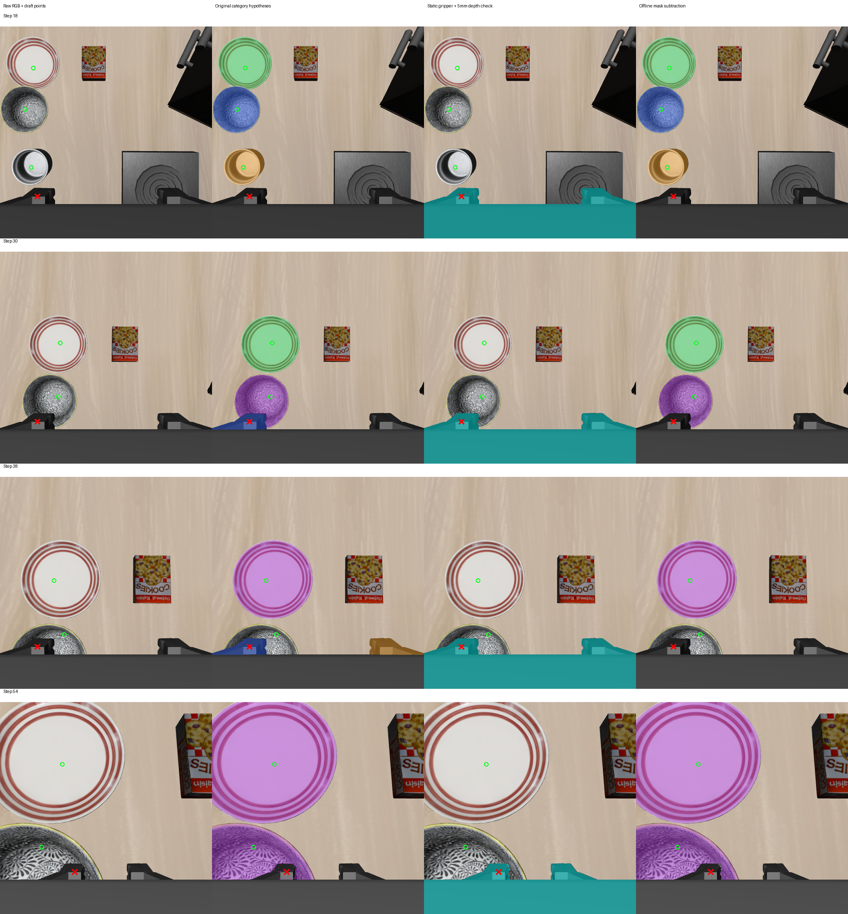

# 2026-10-04：静态夹爪几何投影与当前深度对照

## 做了什么

从个人服务器实际使用的 robosuite 1.4.1 环境读取静态 Panda XML、PandaGripper XML、夹爪 STL 网格和本体观测/相机坐标定义，打包到个人目录后下载。没有启动仿真、读取场景物体状态或接触状态，也没有运行新的策略动作。

新增独立离线脚本，将静态夹爪可视网格按当前两夹指关节位置变换到腕部相机坐标，逐三角形投影并用 z-buffer 计算最近表面的 optical-Z。像素采样使用中心 `(x+0.5, y+0.5)`，深度使用透视正确插值。随后与当前 RGB-D 深度作 2/5/10 mm 三种容差对照；仅将投影内且深度一致的像素作为离线夹爪排除候选。

这一步只处理腕部视角的夹爪可视网格，没有投影整条机械臂，没有接入感知 provider 或恢复执行。七关节位置尚未用于机械臂正向运动学。

## 坐标核对

安装源码明确了两个不同参考点：

- `robot0_eef_pos` 是 gripper grip site 的世界位置。
- `robot0_eef_quat` 是机器人末端 body（right_hand）的世界方向，顺序为 `xyzw`。

静态 XML 中腕部相机装在 right_hand；相机辅助函数对 OpenGL 轴应用 `diag(1,-1,-1)` 修正。脚本据此用已保存相机标定反算 right_hand，再换算 grip site，与白名单本体观测独立比较。

12 帧最大位置残差为 **0.561 mm**，最大旋转残差为 **0.0347°**。残差非零，来源尚未定位，不能声称传感器严格同时更新或变换完全吻合。本轮采用原保存相机标定和夹指位置作诊断，不拟合新外参、不根据参考点调整几何。

## 稀疏参考点对照

使用前一轮同一组助手草稿：第 18/30/38/54 步共 9 个物体点、4 个机器人点。它们尚未经人工复核，此前看过物体检测输出，不是盲测标签；参考点未参与投影。

| 草稿点检查 | 上轮文本 robot gripper 扣除 | 本轮静态夹爪 + 当前深度 |
| --- | ---: | ---: |
| 机器人参考点覆盖 | 3/4 | 4/4 |
| 物体正确类别覆盖：扣除前 → 后 | 8/9 → 3/9 | 8/9 → 8/9 |
| 原先正确类别覆盖被误删的点 | 5 | 0 |
| 原物体候选中的机器人负点：扣除前 → 后 | 2/4 → 0/4 | 2/4 → 0/4 |
| 12 帧物体跨类别 mask 冲突：扣除前 → 后 | 9 → 8 | 9 → 9 |

本轮 2/5/10 mm 三种容差在上述点检查中结果相同，没有选择部署容差。9 个物体点均未落入夹爪深度一致区域；其中一个 bowl 点本来就没有正确类别覆盖，本轮没有补回该漏检。

这是针对所选可见点的改进证据，不能推广为整帧零误删、完整机器人分割或新场景可靠性。物体之间的 bowl/ramekin、plate/ramekin 冲突仍存在，夹爪几何排除不能自动核验物体语义身份。

## 可视化

四行分别为第 18/30/38/54 步。从左至右：原始 RGB、原物体类别候选、静态夹爪且深度差不超过 5 mm 的区域（青色）、离线扣除后的物体候选。绿色圈为物体草稿点，红叉为机器人草稿点。蓝/绿/橙分别为 bowl/plate/ramekin 假设，紫色表示不同类别覆盖同一区域。



第 30/38 步夹爪上的 bowl 假设被清除，物体的类别重叠仍保留。右上侧可见机械臂区域并未作为整臂几何排除；本轮不能据此保证所有机器人污染都已去除。

## 限制与核验

每帧有 4125 个三角形因至少一个顶点位于近裁剪平面后而跳过；脚本尚未实现三角形近面裁剪，部分轮廓可能缺失。只渲染 XML group=1 的夹爪可视 mesh，不含碰撞几何、机械臂 mesh 或未知附件。深度一致也不能证明接触、夹持、物体身份或目标完成。

4 项针对性数值测试通过：四元数顺序与无效输入、像素中心透视深度、最近表面与三角形顺序无关、跨近面三角形排除计数。完整 12 帧实际运行完成，投影 artifact 重新加载并重算深度一致区域；输入、源码、模型清单 SHA-256 全部一致。源码和测试没有更改在线运行时。

指定三个 oracle 模块的导入拦截尝试为 0；这不是任意内存访问审计。诊断环境动作和 policy 推理为 0。报告生产兼容、身份、规划和执行标记均为 false，**实际 recovery 动作仍为 0**。

## 下一步

先在候选层记录静态夹爪覆盖比例和剩余物体区域，明确区分“候选几乎全部属于夹爪”与“物体局部被夹爪遮挡”；避免仅因删除部分像素就把原错误标签当成正确目标。随后用当前双相机证据核验剩余 bowl/ramekin 类别冲突，继续保留歧义为 unknown。整臂排除需要另行核对静态连杆模型、正向运动学及基座坐标，尚未实现。

## 数据与复现

- [原始逐帧投影及坐标残差报告](rgbd_static_wrist_gripper_report_20261004.json)
- [重载、三容差离线扣除、模型包哈希审计](rgbd_static_wrist_gripper_audit_20261004.json)
- 完整输出：`D:\大三上\科研\static-wrist-gripper-20261004`。
- 静态模型包：`D:\大三上\科研\static-panda-model-20261004.zip`，SHA-256 为 `1d91eedbcc32f458207a695b18f895538116e41a57f8e420ee9891aeaf8bfc08`。
- 解压后的模型及源码清单：`D:\大三上\科研\static-panda-model-20261004\manifest.json`。
- 服务器来源：个人环境 `/mnt/sdb/24_yyx/envs/libero-official/lib/python3.8/site-packages/robosuite`，导出包位于个人目录 `/mnt/sdb/24_yyx/demo/static-panda-model-20261004.zip`。

在仓库根目录运行，输出目录必须未存在：

```powershell
& 'D:\大三上\科研\.venvs\rgbd-perception\Scripts\python.exe' `
  scripts/recovery/skill_pipeline/probe_static_wrist_gripper.py `
  --input-dir 'D:\大三上\科研\visual-policy-dual-48-20261004' `
  --model-dir 'D:\大三上\科研\static-panda-model-20261004' `
  --reference-json experiments/robot/libero/skill_pipeline/fixtures/wrist_robot_points_20261004.json `
  --out-dir 'D:\大三上\科研\static-wrist-gripper-new'
```
