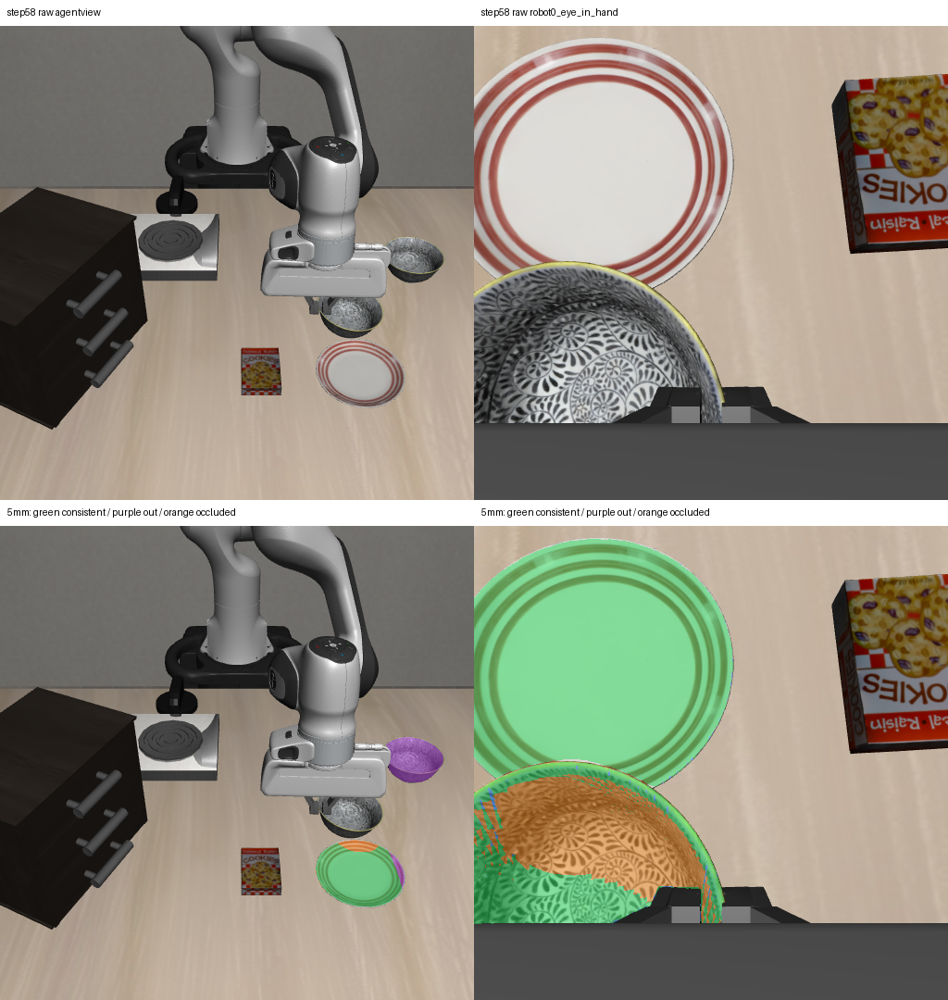

# 2026-10-04：同步终态双视角投影与运动段采集补齐

## 现有数据范围

检查真实 Pi0 48 步实验产物后，12 个查询帧（第 10–54 步）均只有固定相机的完整 RGB-D 观测。策略 IPC 中虽有腕部 RGB，但没有对应腕部深度及逐帧标定，不能用于同帧 RGB-D 几何投影。只有第 58 步终态保存了同步、带标定的 agentview 与 robot0_eye_in_hand RGB-D。

本轮只对第 58 步做双向投影，**没有拿第 58 步腕部观测与第 54 步配对**。实际尝试该错误配对被同步检查拒绝。此次结果不能直接验证此前第 42–54 步的机械臂/物体重叠区域。

## 方法

读取已有冻结检测的原始 mask，保留两相机的场景拒绝与类别冲突。将源相机每个有效深度像素按 K、T_world_camera 和像素中心约定反投影，再投向目的相机，取目的像素 optical-Z 深度，与预测 optical-Z 比较。

分别报告 2/5/10 mm 深度容差，无部署阈值选择；保存每个源像素的目的坐标、深度差和状态：源深度无效、目的相机后方、图像外、目的深度无效、深度一致、目的表面更近或更远。深度一致的源点再检查落入哪些目的原始 mask，保留跨类别重复命中。

这些是源像素采样点计数，多源点可能落在同一个目的像素；不是唯一目的像素数、语义匹配数、物理身份关联或融合后的几何。

## 5 mm 容差下的实测结果

| 源相机区域 → 目的相机 | 有效源点 | 深度一致 | 目的表面更近 | 图像外/目的相机后方 |
| --- | ---: | ---: | ---: | ---: |
| 固定相机原 bowl mask → 腕部 | 2304 | 0 | 0 | 2304 |
| 固定相机原 plate mask → 腕部 | 5378 | 4766 | 408 | 204 |
| 腕部原 bowl mask → 固定相机 | 36989 | 15501 | 21164 | 0 |

固定相机中的 bowl/ramekin 冲突重叠区域有 2303 个像素，2298 个投影在腕部图像外、5 个位于腕部相机后方，不能依靠此终态腕部视角消除该区域的类别冲突。

固定相机 plate 的 4766 个深度一致源点中，4723 个同时命中腕部 plate 和 ramekin mask，43 个未命中任何腕部原检测。几何一致没有消除文本类别混淆。

反方向，腕部 bowl 与 ramekin 两个原 mask 完全重合。其 15501 个深度一致源点都未命中固定相机任何原检测；21164 个源点在固定相机中对应更近表面，显示另一视角存在遮挡。不能将腕部 mask 的类别、身份或遮挡部分直接写入当前物体场景。

固定相机原 mask 并集的深度一致源点，在 2/5/10 mm 容差下均为 4766；腕部原 mask 并集的对应计数分别为 72319/76340/82989。投影方向、视角、像素密度与容差均影响计数，不能把两方向直接比较成感知精度。

## 图像证据

上排为原始终态 RGB，下排为各自原检测并集投影到另一相机后的状态。绿色为深度一致，紫色为图像外或目的相机后方，橙色为目的表面更近，蓝色为目的表面更远。绿色不表示语义或身份确认。



固定相机原检测包含图中右上碗状区域和盘子，未给出夹爪下方前碗的独立有效检测；腕部图像则显示近处碗状区域被图像边界截断。第二视角具有补充可见区域，但当前检测冲突和遮挡仍使跨视角实例融合缺少可靠证据。

## 本轮采集代码修复

视觉策略诊断循环新增可选 `save_query_observation` 回调，在当前视觉查询完成后、下一次 policy 推理和动作前调用。正式 `--visual_policy_eval` 分支通过该回调采集腕部 RGB-D，核对与本次固定相机观测的 episode、env_step、timestamp、标定版本及全部白名单本体状态一致，再保存到：

```text
frames/stepXXXXXX/observation/            # 既有固定相机观测
frames/stepXXXXXX/robot0_eye_in_hand/      # 新增同步腕部观测
```

查询 trace 新增 `synchronized_query_wrist_saved`。腕部保存失败或同步检查失败会终止该次流程，不执行后续 policy 动作。没有增加环境推进或 detector 查询，不把腕部检测接入 provider，也不增加 recovery 动作。正常旧 recovery 分支未改。

**此代码只完成本地验证，尚未部署到服务器或运行新的真实轨迹。** 原 48 步产物不会因此补出缺失的历史腕部深度；下一次实验需要重新采集。

## 验证与边界

- 新增 `cross_view_pixel_evidence.py` 和独立终态诊断脚本，沿用同步 gate，不确认语义、不修改原 mask、不产生规划/执行授权。
- 3 项像素投影测试通过：像素中心及无效深度状态正确，目的更近表面不被算成一致，非同步帧拒绝。
- 将已有同步检查提取成共享 `validate_synchronized_views`。相关边界/双视角、像素投影、视觉循环共 **21 项测试通过**，其中两个新增循环测试验证逐查询保存的时点、查询和动作数不增加，以及保存失败时动作前中止。
- 实际终态双向、三种容差共 6 组诊断完成；输入与源码哈希复核，输出数组哈希另存。指定三个 oracle 模块的导入尝试为 0，此 guard 不覆盖任意仿真内存访问。
- 本轮没有模型重新推理、policy 推理或环境动作；身份融合与 production_compatible 均为 false。终态诊断源点没有独立人工语义标签，不能作为类别准确率、持物或任务完成评估。

## 数据与复现

- [全部六组投影与原检测冲突](rgbd_terminal_cross_view_report_20261004.json)
- [输入源码哈希核对、错误跨步配对拒绝与输出哈希](rgbd_terminal_cross_view_audit_20261004.json)
- 最终完整产物：`D:\大三上\科研\terminal-cross-view-v2-20261004`。初版产物保留在 `terminal-cross-view-20261004`；最终报告使用同步 gate 提取后的源码重跑版本。

在仓库根目录运行，输出目录必须未存在：

```powershell
& 'D:\大三上\科研\.venvs\vla-dev\Scripts\python.exe' `
  scripts/recovery/skill_pipeline/diagnose_terminal_cross_view.py `
  --input-dir 'D:\大三上\科研\visual-policy-48-20261004' `
  --out-dir 'D:\大三上\科研\terminal-cross-view-new'
```

## 下一步

将逐查询双相机采集部署到个人服务器，先验证真实同步保存，再采集新的策略运动段。对同一步的重叠区域检查跨视角可见性和深度，继续保留类别冲突及 unknown，不凭投影一致替代身份和执行核验。
