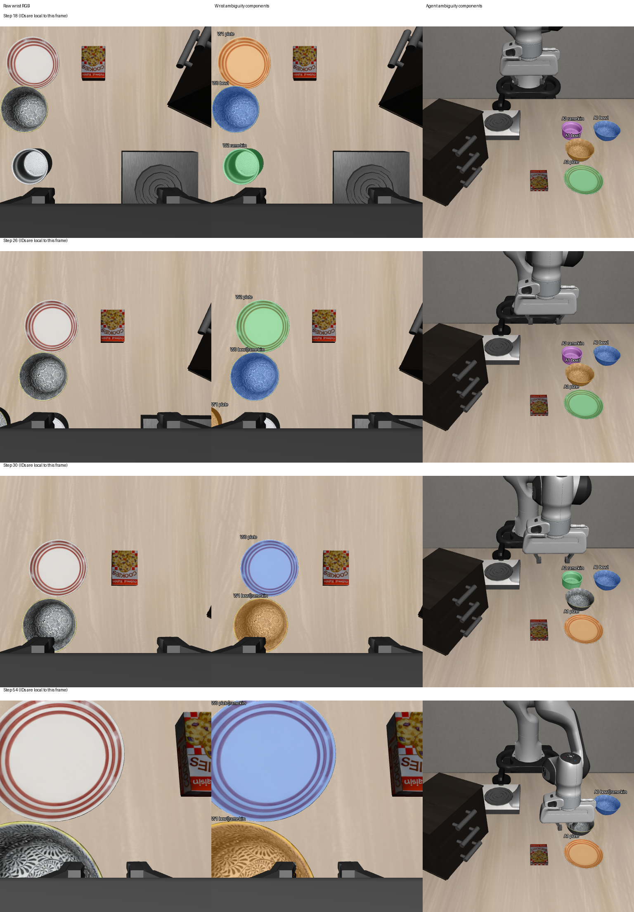

# 2026-10-04：夹爪主导候选隔离、类别歧义与双向几何关联

## 本轮实现

在全部 12 组已保存同步 RGB-D 上继续离线分析，没有重新运行模型、策略或仿真。对每个腕部原始检测记录静态夹爪且当前深度一致区域的覆盖比例，保留原始 mask 索引。

随后完成三项检查：

1. 单独记录夹爪覆盖占主导的候选，避免扣除后剩余几个像素被当成可用物体。
2. 对剩余 mask 的重叠关系建立连通分组，保留全部类别备选。例如 `bowl|ramekin`，不投票选一个类别。这些是歧义分组，可能经重叠链连接多个区域，不能当成已确认物体实例。
3. 在同步双视角之间做正反两个方向的深度一致投影，记录命中源点数、命中目的唯一像素数、命中比例和类别分歧；不建立时间轨迹 ID，也不确认物理身份。

没有修改运行时感知或恢复接口。输出 mask 使用独立离线格式。

## 夹爪候选结果

本轮诊断采用 5 mm 深度一致区域，列出 95%/98%/99.5%/100% 覆盖阈值的敏感性。98% 仅用于当前离线分组，不是经过标注校准的部署阈值。

| 步数 / 原 mask 索引 | 原类别假设 | 夹爪覆盖比例 | 扣除后像素 |
| --- | --- | ---: | ---: |
| 30 / 1 | bowl | 99.94% | 2 |
| 34 / 1 | bowl | 99.91% | 3 |
| 38 / 1 | bowl | 99.41% | 20 |
| 38 / 2 | ramekin | 99.74% | 9 |
| 50 / 3 | ramekin | 99.26% | 24 |

95% 与 98% 阈值均隔离上述 **5 个候选，分布在 4 帧**；99.5% 隔离 3 个，100% 隔离 0 个。阈值影响结果，不能把它们解释为已核验的五个误检。

同组助手草稿点检查中，原先正确类别覆盖保持 **8/9**，机器人负点残留 **0/4**；没有新增正确类别覆盖点。草稿未人工复核，且此前已看过检测输出，不能视为盲测标签或整帧精度。

## 剩余歧义与关联

98% 诊断分组下共有 27 个腕部帧内分组。后 9 帧仍有类别歧义，分组不会消除语义冲突。

为避免将少数边界命中当成可靠对应，本轮另列双向命中比例均至少 80%、每个方向至少 20 个目的唯一像素的几何强度检查。它仅用于诊断，不是身份核验或生产 gate。50%/80%/95% 比例下通过检查的关联分别为 **21/21/20 条**，这些是跨 12 帧的关联条目，不是 21 个不同物体。

| 环境步 | 腕部分组数 | 类别歧义分组数 | 通过 80% 强度检查的关联 |
| --- | ---: | ---: | ---: |
| 10 | 2 | 0 | 2 |
| 14 | 2 | 0 | 2 |
| 18 | 3 | 0 | 3 |
| 22 | 4 | 1 | 4 |
| 26 | 3 | 1 | 3 |
| 30 | 2 | 1 | 1 |
| 34 | 2 | 2 | 1 |
| 38 | 1 | 1 | 1 |
| 42 | 2 | 2 | 1 |
| 46 | 2 | 2 | 1 |
| 50 | 2 | 2 | 1 |
| 54 | 2 | 2 | 1 |

具体发现：

- 第 10 步腕部 bowl 与固定相机 ramekin 只有正向 5 个源点、3 个唯一目的像素以及反向 3 个点的交叉命中；第 18 步类似交叉命中各只有 1 个点。仅要求双向非零会把这种边界关联也计入，新增强度检查将其排除。
- 第 22 步腕部 W3 的 plate 候选与固定相机 A0 的 bowl 候选关联，双向命中比例约 99.6%/93.2%，唯一目的像素 79/68；第 26 步类似关联约 99.6%/100%，唯一目的像素 169/142。**几何关联存在，但两个视角类别不同**，不能直接从其中一个类别绑定语言目标。
- 第 34–54 步盘状区域的腕部类别备选为 `plate|ramekin`，与固定相机 plate 候选有大量双向命中。几何支持区域对应，仍未提供独立类别核验。
- 第 30/34/42/46/50/54 步的腕部 `bowl|ramekin` 分组没有通过检查的固定相机检测关联。第 38 步没有保留下来的可用 bowl 候选，不能从历史补成当前观察。
- 后期未关联的碗状区域依然有固定相机深度一致点：第 42/46/50/54 步分别为 3459/3771/5337/4921 个源点，但未命中固定相机现有候选，同时有大量点被固定相机前方表面遮挡。没有检测关联不等于不在图像中，也不等于目标不存在或已找回。

## 可视化

行分别为第 18/26/30/54 步；左为腕部原图，中为剩余腕部歧义分组，右为固定相机原候选的歧义分组。颜色仅区分当前帧分组，**不表示类别、跨帧身份或跨视角匹配**。W/A 编号仅在各自当前帧内有效；文字列出原类别备选。



第 26 步底部边缘的 W1 plate 与固定相机 A0 bowl 形成几何关联。第 30 步夹爪主导 bowl 已隔离，真正碗状区域仍为 bowl/ramekin 歧义。第 54 步两个视角仍有不同类别组合，不能将它们直接转换成可执行目标。

## 核验与当前边界

5 项针对性测试通过，覆盖重叠链、阈值边界与未核验标记、源点和唯一目的像素分开计数、弱边界命中排除、无效输入。完整 12 帧运行及产物重载完成：逐组重建 mask 并核对原始索引分区、正反投影请求像素分区，核对当前输入/源码哈希及上一轮全部静态投影产物哈希。

诊断 policy 推理和环境动作均为 0，身份融合、类别核验、规划、执行、生产兼容均未开启。指定三个 oracle 模块的导入拦截尝试为 0，该 guard 不等于任意内存访问审计。静态夹爪模型近面裁剪和整臂覆盖的限制仍然适用。

**实际 recovery 动作仍为 0。** 目前进展是能将夹爪主导碎片、物体类别歧义、弱边界关联及有几何支持的类别分歧分别记录清楚。下一步针对这些当前可见区域整理语义核验样例，并研究目标级关联；不通过阈值调整或多数投票宣称物体身份已经确认。

## 文件与复现

- [逐候选覆盖、帧内分组及双向关联原报告](rgbd_wrist_candidate_groups_report_20261004.json)
- [阈值对照、分组重载与哈希审计](rgbd_wrist_candidate_groups_audit_20261004.json)
- 完整最终产物：`D:\大三上\科研\wrist-candidate-groups-v2-20261004`。
- `wrist-candidate-groups-20261004` 为未加入几何强度统计的早期诊断产物，保留追溯；本记录使用 v2。

在仓库根目录运行，输出目录必须未存在：

```powershell
& 'D:\大三上\科研\.venvs\vla-dev\Scripts\python.exe' `
  scripts/recovery/skill_pipeline/diagnose_wrist_candidate_groups.py `
  --input-dir 'D:\大三上\科研\visual-policy-dual-48-20261004' `
  --wrist-root 'D:\大三上\科研\wrist-detection-sequence-20261004' `
  --gripper-root 'D:\大三上\科研\static-wrist-gripper-20261004' `
  --out-dir 'D:\大三上\科研\wrist-candidate-groups-new'
```
