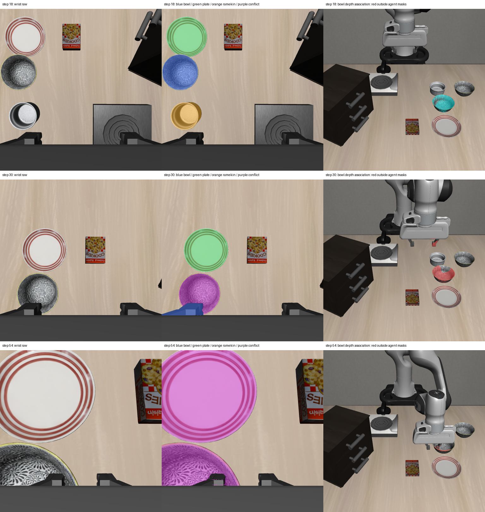

# 2026-10-04：12 帧腕部独立冻结检测与漏检补查

## 本轮做了什么

在新 48 步真实 Pi0 轨迹中，对第 10–54 步全部 12 张同步腕部 RGB 独立运行冻结 GroundingDINO + SAM2。使用与固定相机相同的模型权重、库版本、联合查询、提示词及阈值，没有调词、训练或复用固定相机 mask。提示词仍为 black bowl / plate / silver ramekin，detector_id 为 `grounded-sam2-a62b7dbfbf7a`。

对腕部每个原检测 mask 的有效深度点投向同一步固定相机，采用 5 mm optical-Z 容差，保留深度一致、遮挡、图像外及目的检测 mask 命中情况。全部输出为离线诊断，未写回在线 trace、感知 provider 或恢复执行。

## 结果

| 原始腕部检测结果 | 帧数 |
| --- | ---: |
| 有 bowl 类别假设 | 12/12 |
| 至少一个 bowl 候选未参与场景 mask 重叠冲突 | 6/12 |
| 场景因重叠 mask 拒绝 | 9/12 |
| 至少一个 bowl mask 接触图像边界 | 9/12 |
| 场景没有 mask 重叠冲突 | 3/12，仅第 10、14、18 步 |

“未参与冲突”的六帧为第 10、14、18、30、34、38 步，**不是六帧正确目标或可执行恢复**。第 30 步图像显示一个未参与冲突的 bowl 候选覆盖了夹爪区域，而真正碗状可见区域同时被标为 bowl 和 ramekin。单看类别名、无 mask 冲突或投影一致，都会遗漏这种误检。

后期腕部 bowl 候选确实产生固定相机当前所有原检测以外的深度一致点：

| 环境步 | 腕部 bowl 的深度一致源点 | 其中落在所有固定相机 mask 外 | 图像边界接触 | bowl 候选参与场景冲突 |
| --- | ---: | ---: | --- | --- |
| 42 | 6683 | 6683 | 是 | 是 |
| 46 | 4482 | 4482 | 是 | 是 |
| 50 | 6478 | 6478 | 是 | 是 |
| 54 | 5089 | 5089 | 是 | 是 |

这支持第二视角具有补查固定相机漏检区域的几何线索，但没有证明这些点属于原语言目标、具有正确类别或完整轮廓。源点计数不等于唯一目的像素数量；投影与 mask 边缘差异也会产生未命中点，不能把“所有 mask 外”直接当成新增正确分割面积。

## 原图、类别冲突与投影

每行为第 18、30、54 步。左列腕部原始 RGB，中列原检测类别覆盖，右列腕部 bowl 类别假设的深度一致点投向固定相机：青色点落在已有固定相机检测内，红色点落在所有已有 mask 外。红色不表示正确目标被找回。

中列蓝色为 bowl、绿色为 plate、橙色为 ramekin、紫色为多个不同类别覆盖同一区域。这些都是模型假设，未经语义核验。



第 18 步可见对象有分开的候选；第 30 步碗状区域成为 bowl/ramekin 冲突，另一个蓝色候选覆盖夹爪。第 54 步盘子和近处碗状区域均出现跨类别重叠，碗状区域还被图像边界及机器人遮挡。

图像为助手目视检查，没有独立人工标签；未计算目标精度、mask IoU 或身份成功率。图像边界接触只是一种截断风险指标，不能发现全部遮挡，也不能证明边界以外的几何。

## 当前结论

腕部 RGB 能提供固定相机漏检区域的候选，但当前冻结文本检测在运动段存在类别重复、夹爪误检与视野截断。**本轮没有可直接晋升为原目标的新增核验实例。** 尚未对腕部候选绑定语言目标、建立跨视角实例身份、核验持物或授权动作。

不能通过删除 ramekin 标签或忽略 scene_refusal 来获得“可用目标”；也不能把未参与冲突的夹爪候选当成物体。下一步需要候选级当前图像语义、机器人排除及跨视角关联共同检查，保留有歧义的区域为 unknown。

## 实现和核验范围

新增独立脚本 `probe_wrist_detection_sequence.py`，加载模型一次，对 12 张当前腕部 RGB 分别推理。逐帧核对双相机同步、episode/step/camera、固定相机 detector 配置 ID、权重 SHA-256、库版本和图像尺寸，保存标准原始检测及独立关联报告。场景冲突保存为 scene_refusal，不中断整个离线研究序列，也不接入执行。

12 组腕部检测 artifact 已按原 RGB 哈希重新加载核对；全部输入和源码哈希复核，每个 mask 的七种状态计数之和等于其 mask 像素数，诊断的类别/身份/规划/执行标记均为 false。没有更改运行时模块，未增加重复单元测试；使用已有冻结 detector 和同步投影实现，实际整段运行及产物核验完成。

诊断期间没有 policy 推理、环境动作或仿真启动；指定三个 oracle 模块的导入尝试为 0，此 guard 不是任意仿真内存访问审计。当前报告的 raw_score 是模型原分数，不是类别置信度校准值或身份正确率。

## 数据与复现

- [逐帧检测、边界、冲突与跨视角点命中](rgbd_wrist_detection_sequence_report_20261004.json)
- [配置/输入/源码核对及全部输出哈希](rgbd_wrist_detection_sequence_audit_20261004.json)
- 完整产物：`D:\大三上\科研\wrist-detection-sequence-20261004`。
- 同步输入：`D:\大三上\科研\visual-policy-dual-48-20261004`。

在仓库根目录运行，输出目录必须未存在：

```powershell
$env:OMP_NUM_THREADS='1'; $env:MKL_NUM_THREADS='1'; $env:OPENBLAS_NUM_THREADS='1'
& 'D:\大三上\科研\.venvs\rgbd-perception\Scripts\python.exe' `
  scripts/recovery/skill_pipeline/probe_wrist_detection_sequence.py `
  --input-dir 'D:\大三上\科研\visual-policy-dual-48-20261004' `
  --out-dir 'D:\大三上\科研\wrist-detection-sequence-new' `
  --grounding-model-dir 'D:\大三上\科研\.models-rgbd\grounding-dino-tiny' `
  --sam2-model-dir 'D:\大三上\科研\.models-rgbd\sam2.1-hiera-tiny'
```

下一步优先为腕部候选补充当前可见区域的物体/机器人核验依据，区分“真实碗状区域的类别冲突”和“夹爪误标成碗”两类失败，再研究跨视角目标关联。保持原目标历史身份为待核验状态，不用候选替换掉已丢失的目标。
