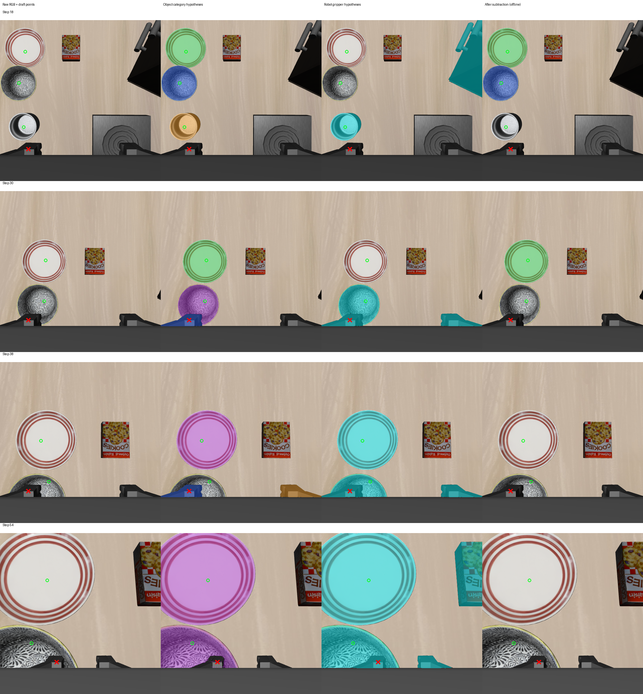

# 2026-10-04：腕部机器人分割与物体误删对照

## 本轮工作

对已完成的 48 步真实 Pi0 轨迹，在第 10–54 步的全部 12 张当前腕部 RGB 上独立运行冻结 GroundingDINO + SAM2，提示为 `robot gripper`。权重、库版本、阈值与此前物体检测保持一致。模型加载一次，逐帧保存机器人原始候选，再从此前腕部物体 mask 中扣除机器人候选的并集。

扣除后的数组使用独立离线格式保存，没有写入运行时感知或执行接口。草稿参考点仅用于事后评分，未输入模型。诊断期间 policy 推理和环境动作均为 0。

## 实测结果

| 检查项 | 结果 |
| --- | ---: |
| 完成独立机器人检测 | 12/12 帧 |
| 有机器人类别候选 | 12/12 帧 |
| 场景跨类别 mask 冲突 | 扣除前 9/12，扣除后 8/12 |
| 草稿点检查 | 4 帧，9 个物体点、4 个机器人点 |
| 机器人并集覆盖机器人点 | 3/4 |
| 正确类别候选覆盖物体点 | 扣除前 8/9，扣除后 3/9 |
| 原先正确类别覆盖被扣除的物体点 | 5 |
| 原物体候选覆盖机器人负点 | 扣除前 2/4，扣除后 0/4 |

参考点是助手目视草稿，尚未经人工复核；此前已看过物体检测输出，不能视为盲测标签。这些稀疏点结果不是 mask 精度、目标身份正确率或恢复成功率。

机器人并集覆盖了 6 个物体参考点，其中第 38 步的 bowl 点在原物体检测中已经没有覆盖。因此，实际损失是 **5 个原先正确类别覆盖点**。原报告保留的字段 `object_reference_points_erased=6` 实际计数的是并集覆盖参考点，命名不精确；审计另列清楚的覆盖数及实际损失数，保留原实验报告和源码哈希以便追溯。

## 图像证据

每行为第 18、30、38、54 步；从左至右为原始 RGB、物体类别假设、机器人类别候选并集、离线扣除结果。绿色圈为物体草稿点，红叉为机器人草稿点。物体候选中蓝色表示 bowl，绿色表示 plate，橙色表示 ramekin，紫色表示不同类别覆盖同一区域；机器人并集为青色。



- 第 18 步：漏掉所选真实夹爪点，却将可见 ramekin 区域标为机器人并扣除。
- 第 30 步：删除夹爪上的误检 bowl，同时删除实际碗状区域的候选。
- 第 38 步：机器人候选覆盖盘子，扣除后原正确 plate 点消失；bowl 草稿点原本已漏检。
- 第 54 步：盘子和近处碗状区域都被机器人并集覆盖并扣除。

冲突减少可能来自删除真实物体，不能据此判断类别消歧成功。`robot gripper` 文本分割不能直接作为机器人排除依据，本轮不接入恢复。

## 核验

12 组机器人原始 artifact 已按对应观测重新加载；逐帧核对保留候选索引，以及扣除 mask 精确等于 `原物体 mask & ~机器人并集`。输入和源码 SHA-256 全部一致，逐点评分重新计算一致。所有类别核验、身份核验、规划、执行和生产兼容标记均为 false。

指定三个 oracle 模块的导入拦截尝试为 0；该导入 guard 不等于任意仿真内存访问审计。本轮没有启动新的仿真或服务器动作，没有改变在线轨迹，也没有实际 recovery 执行。

## 下一步及已检查的条件

转向检查静态机器人几何能否结合已保存的本体状态和相机标定，给出机器人可见区域的独立依据。

当前观测保存了七关节位置、两夹指位置、末端位置和四元数，以及相机内外参。但尚未核验静态机器人网格、关节到连杆变换、末端四元数约定和相机安装关系。仓库文件检索没有发现可直接使用的 Panda URDF/XML；已有 `tiptop_repro/libero_panda_frames.py` 的基座查询依赖旧 `SceneState.robot_joint_debug`，不能直接作为本轮 RGB-D 路线的机器人几何来源。

后续先获取并核对当前安装版本的静态 Panda/夹爪模型与坐标约定，再做离线投影和深度遮挡对照。模型来源和投影尚未完成核验，不应现在就用推测出的机器人轮廓删除物体。恢复动作仍为 0，当前目标是解决误检和身份核验的前置条件。

## 文件与复现

- [完整原实验报告](rgbd_wrist_robot_overlap_report_20261004.json)
- [逐帧重载、精确扣除及哈希审计](rgbd_wrist_robot_overlap_audit_20261004.json)
- 参考点：`experiments/robot/libero/skill_pipeline/fixtures/wrist_robot_points_20261004.json`。
- 脚本：`scripts/recovery/skill_pipeline/probe_wrist_robot_overlap.py`。
- 完整输出：`D:\大三上\科研\wrist-robot-overlap-20261004`。

在仓库根目录运行，输出目录必须未存在：

```powershell
$env:OMP_NUM_THREADS='1'; $env:MKL_NUM_THREADS='1'; $env:OPENBLAS_NUM_THREADS='1'
& 'D:\大三上\科研\.venvs\rgbd-perception\Scripts\python.exe' `
  scripts/recovery/skill_pipeline/probe_wrist_robot_overlap.py `
  --input-dir 'D:\大三上\科研\visual-policy-dual-48-20261004' `
  --object-root 'D:\大三上\科研\wrist-detection-sequence-20261004' `
  --reference-json 'experiments/robot/libero/skill_pipeline/fixtures/wrist_robot_points_20261004.json' `
  --out-dir 'D:\大三上\科研\wrist-robot-overlap-new' `
  --grounding-model-dir 'D:\大三上\科研\.models-rgbd\grounding-dino-tiny' `
  --sam2-model-dir 'D:\大三上\科研\.models-rgbd\sam2.1-hiera-tiny'
```
